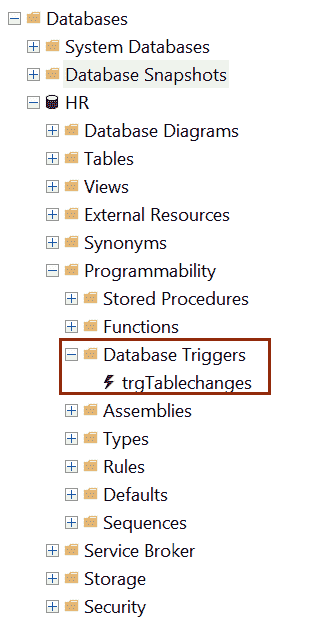
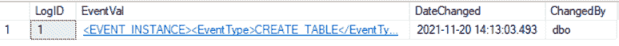
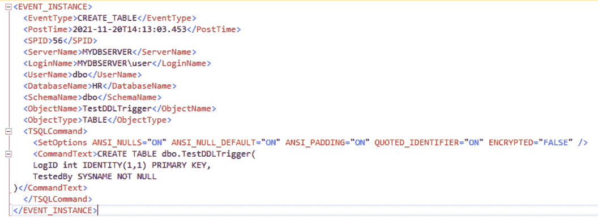

# SQL 服务器中的分布式拒绝服务触发器

> 原文:[https://www.tutorialsteacher.com/sqlserver/ddl-triggers](https://www.tutorialsteacher.com/sqlserver/ddl-triggers)

DDL 触发器响应 DDL 事件，如创建、更改、删除、授予、拒绝、撤销或更新统计信息。例如，您可以定义一个记录 CREATE 或 ALTER TABLE 操作的 DDL 触发器。

DDL 触发器只有在触发它们的事件成功执行后才会触发。它们不能用作[而不是触发器](/sqlserver/triggers#insteadof-triggers)。

您可以创建一个 DDL 触发器来:

*   记录对数据库架构所做的更改；
*   防止对架构进行某些更改；
*   响应数据库模式中的任何更改。

Syntax: DDL Trigger<button class="copy-btn pull-right" title="Copy example code">*Copy*</button> 

```
CREATE TRIGGER trigger_name
ON { DATABASE |  ALL SERVER}
[WITH ddl_trigger_option]
FOR { event_type | event_group }
AS 
    {sql_statement} 
```

在上面的语法中:

*   `trigger_name`是正在创建的新触发器的名称。
*   `ON DATABASE`指定为数据库或所有服务器范围的事件触发触发器。
*   `ddl_trigger_option`指定加密或执行为子句。加密对触发器定义进行加密。is executed 定义了执行触发器的安全上下文。
*   `event_type`指定触发触发器的事件，如 CREATE_TABLE、ALTER_TABLE 等。 `event_group`是一组`event_type`如 DDL_TABLE_EVENTS。

让我们创建一个 DDL 触发器，每当数据库用户创建、更改或删除表时，它都会记录更改。

首先，创建一个数据库表`TableLog`来捕获日志，如下所示。

Example: Log Table<button class="copy-btn pull-right" title="Copy example code">*Copy*</button> 

```
CREATE TABLE dbo.TableLog(
   LogID int IDENTITY(1,1) PRIMARY KEY,
   EventVal xml NOT NULL,
   EventDate datetime NOT NULL,
   ChangedBy SYSNAME NOT NULL
); 
```

现在，创建一个触发器，该触发器将在每次 create、ALTER 或 DROP 表事件发生时被触发。触发器将捕获事件值并记录到`TableLog`表中。

Example: DDL Trigger<button class="copy-btn pull-right" title="Copy example code">*Copy*</button> 

```
CREATE TRIGGER trgTablechanges
ON DATABASE
FOR	
    CREATE_TABLE,
    ALTER_TABLE, 
    DROP_TABLE
AS
BEGIN
    SET NOCOUNT ON;
    INSERT INTO TableLog
    (
       EventVal,
       DateChanged,
       ChangedBy
     )
        VALUES (
           EVENTDATA(),
           GETDATE(),
           USER
        );
END; 
```

每当数据库中的表被创建、更改或删除时，上面的`trgTablechanges`触发器就会被触发。插入`EventVal`字段的`EVENTDATA()`值是 DDL 触发器的内置功能。它以 XML 格式返回事务事件详细信息。 DDL 触发器在可编程性- >数据库触发器下创建，如下所示。

<figure>[](../../Content/images/sqlserver/ddl-trigger.png)</figure>

您可以通过在数据库中创建新表来测试上述触发器。如果触发器按预期工作，则为 CREATE 事件在`TableLog`表中插入一个新行。现在，创建一个名为 TestDDLTrigger 的新表。

Example: Create Table<button class="copy-btn pull-right" title="Copy example code">*Copy*</button> 

```
CREATE TABLE dbo.TestDDLTrigger(
    LogID int IDENTITY(1,1) PRIMARY KEY,
    TestedBy SYSNAME NOT NULL
); 
```

创建上述触发器后，从`TableLog`表中选择行，您会发现`TestDDLTrigger`表有一个新条目，如下所示。

<figure>[](../../Content/images/sqlserver/triggers5.png)</figure>

点击`EventVal`列中的 XML 事件数据，显示事件详情如下

<figure>[](../../Content/images/sqlserver/triggers6.png)</figure>

因此，您可以创建一个 DDL 触发器。****