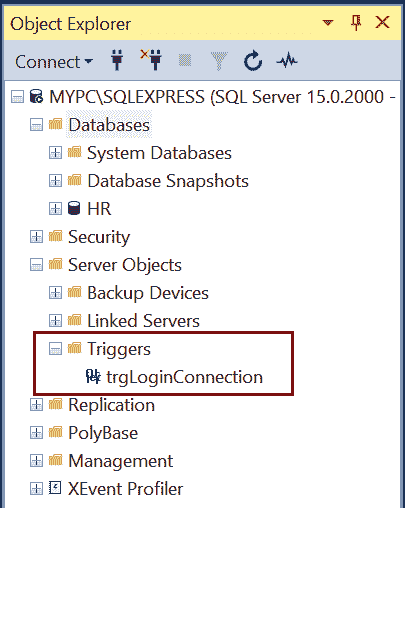

# SQL Server 中的登录触发器

> 原文:[https://www.tutorialsteacher.com/sqlserver/logon-triggers](https://www.tutorialsteacher.com/sqlserver/logon-triggers)

在 SQL Server 中，登录触发器在登录事件时自动触发。它们是 DDL 触发器，在服务器级别创建。我们可以在服务器上定义多个 LOGON 触发器。

通过跟踪登录活动、限制对 SQL Server 的登录或限制特定登录的会话数量，可以使用登录触发器来控制服务器会话。

如果登录已经创建了两个用户会话，以下登录触发器将通过`sa`登录来限制对 SQL Server 的登录尝试。

Example: Create LOGON Trigger 

```
CREATE TRIGGER trgLoginConnection 
ON ALL SERVER WITH EXECUTE AS N'sa'  
FOR LOGON  
AS  
BEGIN  
IF ORIGINAL_LOGIN() = N'sa' AND  
    (SELECT COUNT(*) FROM sys.dm_exec_sessions  
            WHERE is_user_process = 1 AND  
                original_login_name = N'sa') > 2  
			ROLLBACK;  
END; 
```

所有登录触发器都是在服务器对象->触发器文件夹下创建的，如下所示。

[](../../Content/images/sqlserver/logon-trigger.png)*