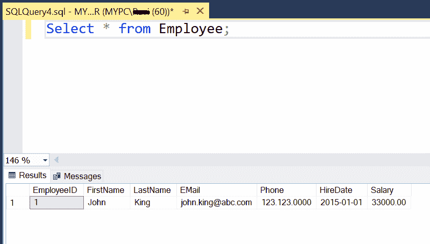

# 使用插入语句将数据插入到 SQL Server 的表中

> 原文:[https://www.tutorialsteacher.com/sqlserver/insert-data](https://www.tutorialsteacher.com/sqlserver/insert-data)

INSERT INTO 语句用于将单个或多个记录插入到 SQL Server 数据库的表中。

#### 语法:

```
INSERT INTO table_name(column_name1, column_name2...) 
VALUES(column1_value, column2_value...); 
```

在这里，我们将数据插入到我们在[创建表](/sqlserver/create-table)一章中创建的以下`Employee`表中。

<figure>[](../../Content/images/sqlserver/insert1.png)</figure>

以下 INSERT INTO 语句将在 SQL Server 数据库的上述`Employee`表的所有列中插入一行。

T-SQL: Insert Data<button class="copy-btn pull-right" title="Copy example code">*Copy*</button> *```
INSERT INTO Employee(FirstName, LastName, EMail, Phone, HireDate, Salary)
VALUES('John','King','[[email protected]](/cdn-cgi/l/email-protection)','123.123.0000','01-01-2015', 33000); 
```

请注意`EmployeeId`列是一个标识列，因此值将在每个 insert 语句中自动生成。所以，`EmployeeId`列不包含在上面的 insert 语句中。

要查看插入的数据，在查询编辑器中执行`Select * from Employee;`查询，如下图所示。

<figure>[](../../Content/images/sqlserver/insert2.png)</figure>

## 向所有列插入值

要向表的所有列插入值，不需要用表名指定列名。如下所示，在表格中按顺序指定每列的值。

T-SQL: Insert Data<button class="copy-btn pull-right" title="Copy example code">*Copy*</button> *```
INSERT INTO Employee
VALUES('Neena','Kochhar','[[email protected]](/cdn-cgi/l/email-protection)','123.000.000','05-12-2018',17000); 
```

Note:**Any change in the sequence, the number of values, or its data type may result in an error or incorrect data.* *## 将值插入特定列

要将数据插入特定列，请在括号中指定列名。确保其他列允许空值；否则，将会出现错误。

下面只在`FirstName`和`LastName`列插入数据。

SQL Script: Insert Data to Specific Columns<button class="copy-btn pull-right" title="Copy example code">*Copy*</button> *```
INSERT INTO Employee(FirstName, LastName)
VALUES('James','Bond'); 
```

Note:**You must insert data to all NOT NULL columns; otherwise, it will raise an error.* *## 插入多条记录

在一个 INSERT INTO 语句中插入多条记录，方法是将多条记录放在 VALUES 后面的括号中。下面将在 SQL Server、MySQL、PostgreSQL、SQLite 数据库的`Employee`表中插入两条记录。

T-SQL: Insert Multiple Records<button class="copy-btn pull-right" title="Copy example code">*Copy*</button> *```
INSERT INTO Employee 
VALUES 
('Kevin','Weiss','[[email protected]](/cdn-cgi/l/email-protection)','123.123.12','08-10-2019',17000),
('Lex','De Haan','[[email protected]](/cdn-cgi/l/email-protection)','123.123.13','05-05-2019',15000),
('Laura','Bissot','[[email protected]](/cdn-cgi/l/email-protection)','123.123.15','02-08-2019',40000); 
```

要在特定列中插入多条记录，请在括号中指定列名，如下所示。

T-SQL: Insert Multiple Records in Specific Columns<button class="copy-btn pull-right" title="Copy example code">*Copy*</button> *```
INSERT INTO Employee(FirstName, LastName) 
VALUES 
('Kevin','Weiss'),
('Lex','De Haan'),
('Laura','Bissot'); 
```

现在，执行`Select * from Employee`查询将显示以下结果。

<figure>[](../../Content/images/sqlserver/insert3.png)</figure>*******