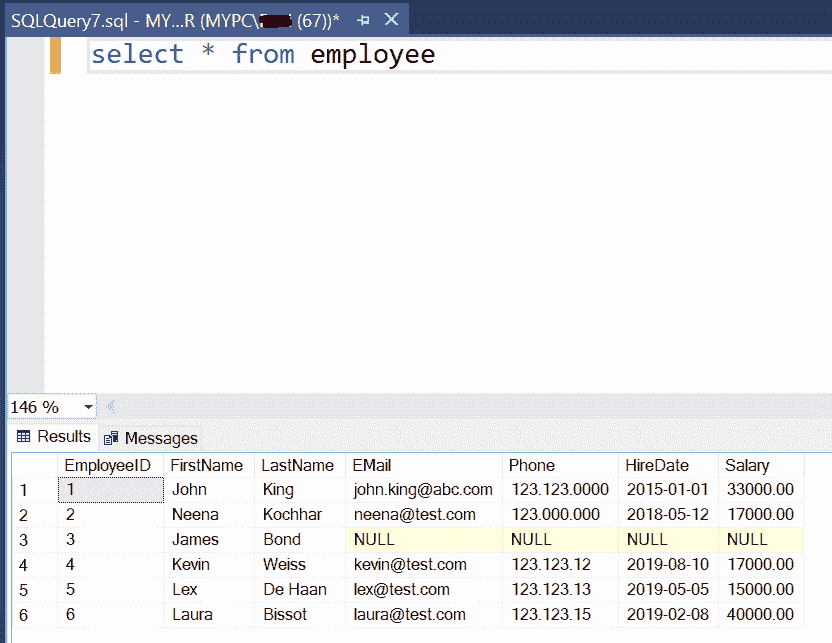
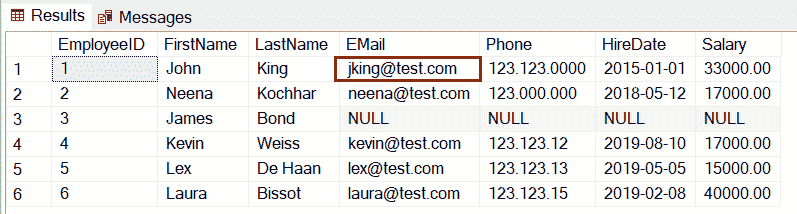
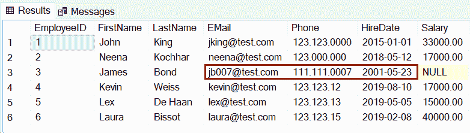
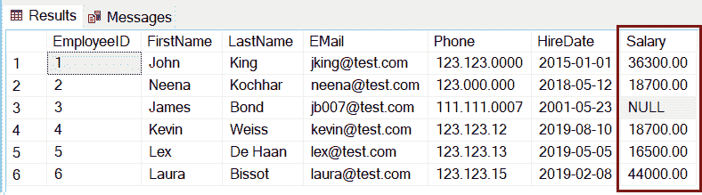

# SQL Server:使用更新语句更新表中的数据

> 原文:[https://www.tutorialsteacher.com/sqlserver/update-data](https://www.tutorialsteacher.com/sqlserver/update-data)

SQL Server 支持标准的 SQL 来更新表中的数据。使用 UPDATE TABLE 语句在 SQL Server 中更新表中的记录。

#### 语法:

```
UPDATE table_name
SET column_name1 = new_value,
column_name2 = new_value,
...
[WHERE Condition]; 
```

注意 [WHERE 子句](/sqlserver/where-clause)是可选的，但是您应该使用它来更新特定的记录。 不带 WHERE 子句的 UPDATE 语句将更新表中所有行的值。

这里我们将更新如下所示的`Employee`表中的数据。

<figure>[](../../Content/images/sqlserver/insert3.png)</figure>

以下 UPDATE 语句将把`Employee`表`EmployeeID`中`Email`列的值更改为 1。

SQL Script: Update Statement<button class="copy-btn pull-right" title="Copy example code">*Copy*</button> *```
UPDATE Employee
SET email = '[[email protected]](/cdn-cgi/l/email-protection)'
WHERE EmployeeID = 1; 
```*  *现在，`Select * from Employee`查询将显示以下结果。

<figure>[](../../Content/images/sqlserver/update1.png)</figure>

## 更新多列

使用 UPDATE 语句，可以通过指定多个用逗号分隔的`column-name = value`来更新多个列，如下所示。

SQL Script: Update Multiple Columns<button class="copy-btn pull-right" title="Copy example code">*Copy*</button> *```
UPDATE Employee
SET Email = '[[email protected]](/cdn-cgi/l/email-protection)', Phone = '111.111.0007', HireDate='05-23-2001'
WHERE EmployeeID = 3; 
```*  *现在，`Select * from Employee`查询将显示以下结果。

<figure>[](../../Content/images/sqlserver/update2.png)</figure>

注意:如果指定的 WHERE 子句没有匹配的记录，那么 UPDATE 语句将不会更新任何记录。

您可以使用计算值更新列。下面将使用一个 UPDATE 语句将`Employee`表中所有员工的工资提高到 10%。

T-SQL: Update Calculated Data<button class="copy-btn pull-right" title="Copy example code">*Copy*</button> *```
UPDATE Employee 
SET Salary = Salary + (Salary * 10/100); 
```*  *现在，`Select * from Employee`查询将显示以下结果。

<figure>[](../../Content/images/sqlserver/update3.png)</figure>

您可以使用子查询从一个表更新另一个表中的数据。以下 UPDATE 语句将通过从`Employee`表中选择`Salary`来更新`Consultant`表中的`Salary`以获得匹配的`EmployeeID`值。

T-SQL: Update Values from Another Table<button class="copy-btn pull-right" title="Copy example code">*Copy*</button> *```
UPDATE Consultant
SET salary = (SELECT salary
FROM Employee 
WHERE Employee.EmployeeID = Consultant.ConsultantID); 
```*  *注意:

*   子查询必须返回符号列值；否则，将会引发错误。
*   如果子查询找不到任何匹配的行，则该值将更新为空。****