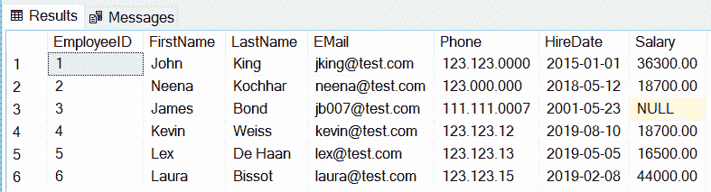
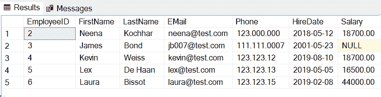
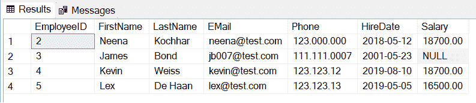
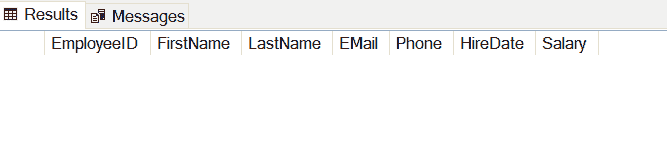

# 在 SQL Server 中使用`DELETE`语句删除数据

> 原文：<https://www.tutorialsteacher.com/sqlserver/delete-data>

使用 `DELETE`语句从当前架构中的现有表或您拥有 DELETE 权限的架构的表中删除数据。

#### 语法:

```sql
DELETE FROM table_name [WHERE Condition];
```

这里我们将删除如下所示的`Employee`表中的数据。



您可以使用`WHERE`子句从表中删除特定记录。 下面将从`Employee`表中删除一条记录，其中`EmployeeID`为 1。

T-SQL: Delete a Record 

```sql
DELETE FROM Employee WHERE EmployeeID = 1; 
```

现在，`Select * from Employee`查询将显示以下行。



同样，下面将从`Salary`大于 40000 的`Employee`表中删除所有员工。

T-SQL: Delete Records 

```sql
DELETE FROM Employee WHERE Salary > 40000; 
```

现在，`Select * from Employee`查询将显示以下行。



以下 DELETE 语句将删除`Employee`表中的所有记录。

T-SQL: Delete All Rows 

```sql
DELETE FROM Employee; 
```

现在，`Select * from Employee`查询将显示空表。



*Note:**You cannot delete the value of a single column using the DELETE statement. Use the UPDATE statement to set it NULL.****