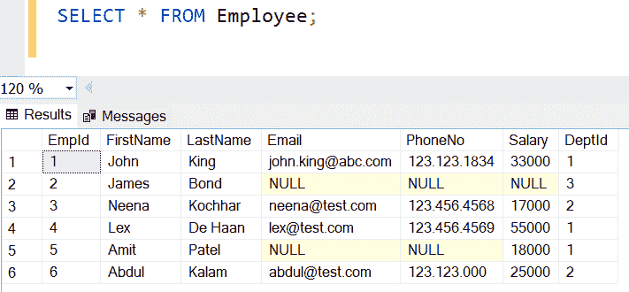
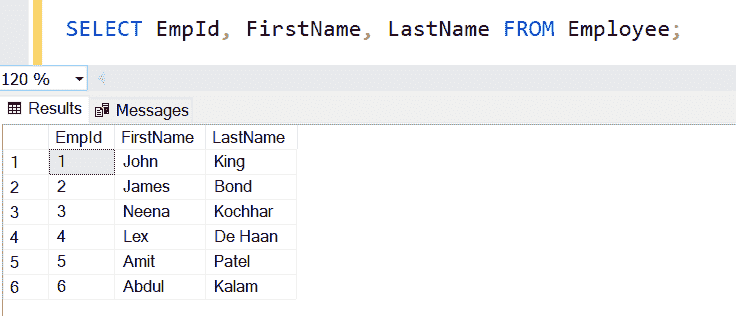
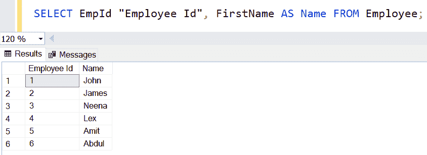
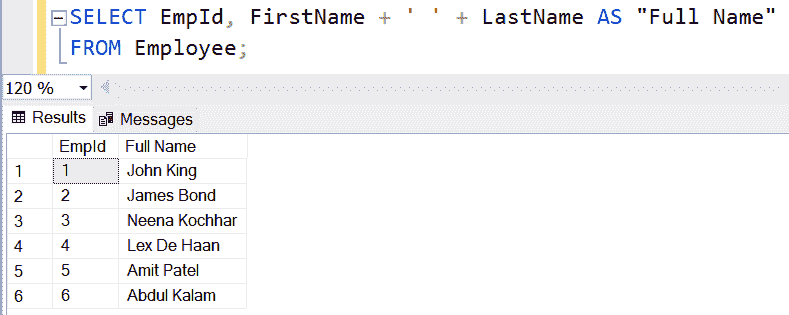

# 选择语句

> 原文:[https://www.tutorialsteacher.com/sqlserver/select-query](https://www.tutorialsteacher.com/sqlserver/select-query)

在 SQL Server 中，SELECT 语句用于从一个或多个现有表中检索行/列数据。它遵循 SQL(结构化查询语言)标准。

#### 语法:

```
SELECT column1, column2,...columnN 
FROM table_name 
```

## 选择所有列

`*`运算符代表一个表的所有列。因此，您不需要在 SELECT 查询中指定每个列名来从所有列中获取数据。

SQL Script: Select Query 

```
SELECT * FROM Employee; 
```

上面的查询从`Employee`表中返回所有的行和列数据，如下所示。

<figure>[](../../Content/images/sqlserver/select1.png)

<figcaption>Selecting All Records</figcaption>

</figure>

## 选择特定列数据

在 SELECT 语句中指定列名，以便只从这些列中获取数据，如下所示。

SQL Script: Select Query 

```
SELECT EmpId, FirstName, LastName FROM Employee; 
```

上述查询将显示以下结果。

<figure>[](../../Content/images/sqlserver/select2.png)</figure>

## 列和表的别名

您可以为 SELECT 查询中的一列或多列指定别名。别名是查询中表或列的临时名称。

别名的优势:

*   别名使列在结果集中更易读。
*   Alias 用于为查询中的表提供一个小的、缩写的和有意义的名称，以便在连接多个表时可以方便地引用表。
*   Alias 帮助我们在从多个表中获取数据的情况下识别哪个列属于哪个表。

以下查询指定`EmpId`的`"Employee Id"`，并在选择查询中将`Name`作为`FirstName`列的别名。 如果需要空格或其他字符串，请在单引号或双引号中指定别名。

SQL Script: Column Alias 

```
SELECT EmpId "Employee Id", FirstName AS Name FROM Employee; 
```

上述查询将显示以下结果。

<figure>[](../../Content/images/sqlserver/select3.png)</figure>

## +选择语句中的运算符

MS SQL Server 中的`+`运算符连接字符串值或添加数值。 下面连接结果中的两个`varchar`列。

SQL Script: + in Select Query 

```
SELECT EmpId, FirstName + ' ' + LastName AS "Full Name" 
FROM Employee; 
```

上述查询将显示以下结果。

<figure>[](../../Content/images/sqlserver/select4.png)</figure>

下面只是总结了选择查询中的数字。

SQL Script: + Operator 

```
SELECT 10 + 15; --returns 25
SELECT 10.5 + 15; --returns 25.5
```

## FROM 子句

SELECT 语句必须有 FROM 子句。FROM 子句用于列出要从中选择数据的表名，并指定这些表之间的连接。

您可以在 FROM 子句中指定多个表来从中选择数据。但是，如果表具有相同的列，则需要在 SELECT 查询中指定完整的列名，如`table_name.column_name`。

下面从两个表中选择列。

SQL Script: Select Data From Multiple Tables 

```
SELECT * FROM Employee, Deparatment;

SELECT Employee.*, Department.* FROM Employee, Deparatment;

SELECT emp.*, dept.* FROM Employee emp, Deparatment dept; 

SELECT emp.FirstName, dept.DipartmentName FROM Employee emp, Deparatment dept; 
```

在 FROM 子句中有多个表而没有 WHERE 子句和 JOIN 将从每个表中返回重复的数据。例如，如果`Employee`表有两行，`Department`表有两行，那么上面的查询将返回四行，其中一个表的列将对另一个表的列重复。 您将在加入教程中了解更多信息。******