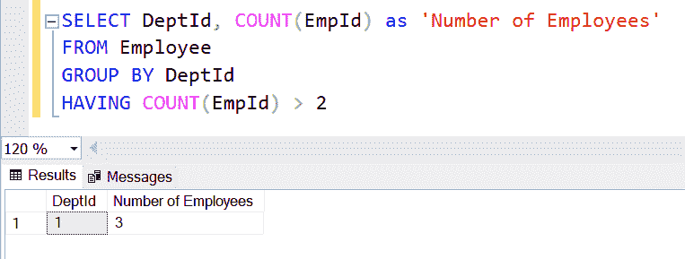
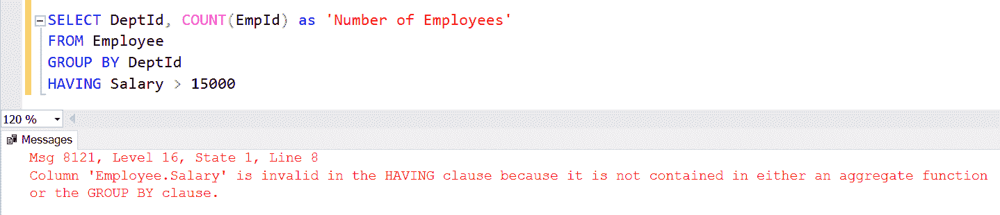

# SQL Server - HAVING 子句

> 原文:[https://www.tutorialsteacher.com/sqlserver/having](https://www.tutorialsteacher.com/sqlserver/having)

在 SQL Server 中，HAVING 子句包含一个或多个条件，这些条件对于记录组应该为真。它就像 GROUP BY 子句中的 WHERE 子句。唯一的区别是 WHERE 子句不能与聚合函数一起使用，而 HAVING 子句可以使用聚合函数。

HAVING 子句总是在 GROUP BY 子句之后，ORDER BY 子句之前。

#### 语法:

```
SELECT column1, column2,...columnN 
FROM table_name
[WHERE]
[GROUP BY column1, column2...columnN]
[HAVING conditions]
[ORDER BY] 
```

  HAVING Characteristics:

*   HAVING 子句用于筛选出分组记录。
*   HAVING 子句必须在 GROUP BY 子句之后，ORDER BY 子句之前。
*   HAVING 子句可以包含一个或多个条件。
*   HAVING 条件只能包含与 GROUP BY 子句一起使用的列。若要在 HAVING 条件中使用其他列，请对它们使用聚合函数。

出于演示目的，我们将在这里的所有示例中使用以下`Employee`和`Department`表。

[](../../Content/images/sqlserver/demo-tables.png)

在[分组依据](/sqlserver/groupby)部分，我们使用以下查询来检索每个部门的员工数量，如下所示。

SQL Server: GROUP BY 

```
SELECT DeptId, COUNT(EmpId) as 'Number of Employees' 
FROM Employee
GROUP BY DeptId; 
```

[](../../Content/images/sqlserver/groupby2.png)

现在，要过滤上面 GROUP BY 查询的结果，请使用 HAVING 子句和聚合函数，如下所示。

SQL Server: GROUP BY 

```
SELECT DeptId, COUNT(EmpId) as 'Number of Employees' 
FROM Employee
GROUP BY DeptId
HAVING COUNT(EmpId) > 2 
```

请注意，我们在 HAVING 子句中使用了聚合函数`COUNT()`，因为`EmpId`不包含在 GROUP BY 子句中。 以上查询将显示以下结果。

[](../../Content/images/sqlserver/having1.png)

以下查询将抛出一个错误，因为`Salary`列不包含在 GROUP BY 子句中，并且不使用聚合函数。

SQL Server: GROUP BY 

```
SELECT DeptId, COUNT(EmpId) as 'Number of Employees' 
FROM Employee
GROUP BY DeptId;
HAVING Salary > 15000 
```

[](../../Content/images/sqlserver/having2.png)***