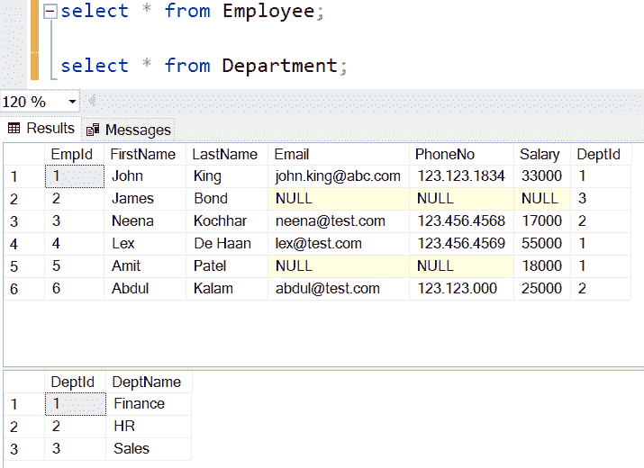
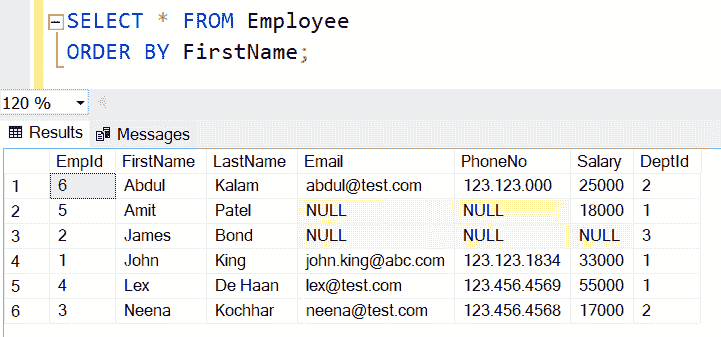
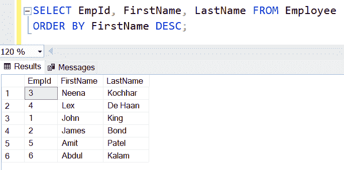
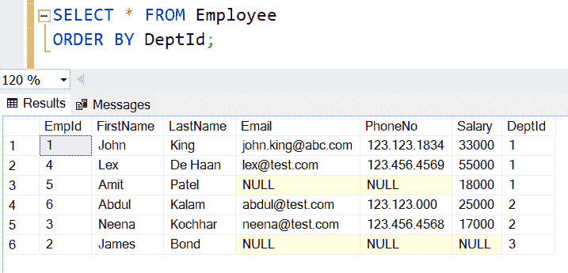
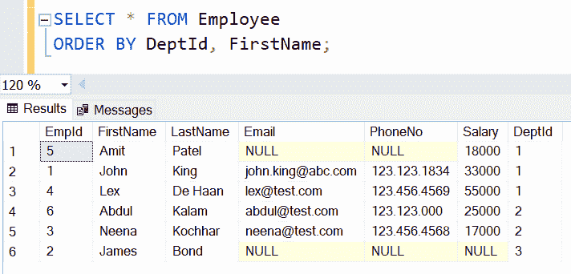
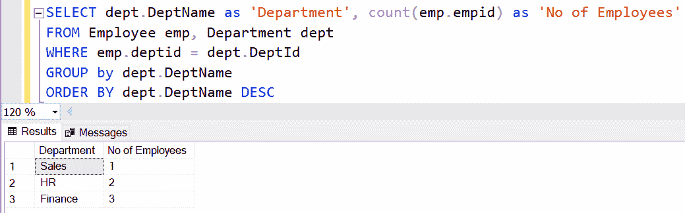

# SQLServer `ORDER BY`子句

> 原文：<https://www.tutorialsteacher.com/sqlserver/orderby>

在 SQL Server 中，ORDER BY 子句在 `SELECT`查询中用于按一列或多列的升序或降序对结果进行排序。

#### 语法:

```sql
SELECT column1, column2,...columnN 
FROM table_name
[WHERE]
[GROUP BY]
[HAVING]
[ORDER BY column(s) [ASC|DESC]] 
```

  ORDER BY Characteristics:

*   ORDER BY 子句用于以升序或降序获取一列或多列上的已排序记录。
*   如果查询中有 WHERE、GROUP BY 和 `HAVING`子句，则 ORDER BY 子句必须在它们之后。
*   使用 ASC 或 DESC 指定列名后的排序顺序。使用 ASC 以升序对记录进行排序，或者使用 DESC 以降序进行排序。默认情况下，如果未指定顺序，ORDER BY 子句将按升序对记录进行排序。

出于演示目的，我们将在所有示例中使用以下`Employee`和`Department`。



以下查询将从`Employee`表中获取所有记录，并按照`FirstName`值的升序对结果进行排序。

SQL Server: Select Query with QRDER BY Clause 

```sql
SELECT * FROM Employee
ORDER BY FirstName; 
```

上述查询将在 SQL Server 中返回以下结果。



以下查询将按`FirstName`值的降序返回行。

SQL Server: Sorting in Descending Order 

```sql
SELECT EmpId, FirstName, LastName FROM Employee
ORDER BY FirstName DESC; 
```

上述查询将在 SQL Server 中返回以下结果。



## 按多列排序

ORDER BY 子句可以包含不同排序顺序(升序或降序)的多列。当 ORDER BY 子句包含多列时，它将根据第一列对记录进行排序，如果任何两个或更多记录在第一个 ORDER BY 列中具有相同的值，它将根据第二个 ORDER BY 列对它们进行排序。

要理解这一点，首先按`DeptId`列对结果进行排序，如下图。

SQL Server: QRDER BY Clause 

```sql
SELECT * FROM Employee
ORDER BY DeptId; 
```

上面的查询将显示以下结果。



现在，在 ORDER BY 子句中包含`FirstName`列。

SQL Server: Multiple Columns in QRDER BY Clause 

```sql
SELECT * FROM Employee
ORDER BY DeptId, FirstName; 
```

上面的查询将首先按照`DeptId`对结果进行排序，然后具有相同`DeptId`的行将按照`FirstName`进行排序。请记住，我们没有包括 ASC 或 DESC，因此默认情况下，它将按升序对结果进行排序，如下所示。



## 记录排序组

以下查询对记录组进行排序。

SQL Server: GROUP BY 

```sql
SELECT dept.Name as 'Department', count(emp.empid) as 'No of Employees'
FROM Employee emp, Department dept
WHERE emp.deptid = dept.DeptId
GROUP by dept.DeptName
ORDER BY dept.DeptName DESC 
```

*****