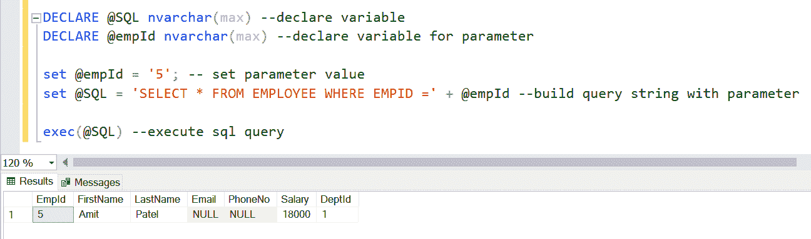
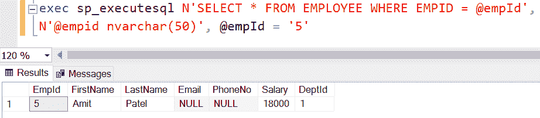

# SQL Server 中的动态 SQL

> 原文:[https://www.tutorialsteacher.com/sqlserver/dynamic-sql](https://www.tutorialsteacher.com/sqlserver/dynamic-sql)

动态 SQL 是一种编程技术，您可以将 SQL 查询构建为字符串，并在运行时动态执行它。它允许您根据应用程序的需求，使用变量动态构建通用查询。这使得动态 SQL 更加灵活，因为它不是硬编码的。

例如，下面是一个动态 SQL。

Example: Dynamic SQL 

```
DECLARE @sql nvarchar(max) --declare variable
DECLARE @empId nvarchar(max) --declare variable for parameter

set @empId = '5' --assign value to parameter variable
set @sql = 'SELECT * FROM EMPLOYEE WHERE EMPID =' + @empId --build query string with parameter

exec(@sql) --execute sql query 
```

在上面的例子中，我们首先声明变量，`@sql`用于 SQL 查询，`@empId`用于参数。 然后，`@empId = '5'`语句给变量赋值。 `set @sql =` 语句将 SQL 查询构建为字符串，并使用`+`运算符追加参数变量。 最后，`exec(@sql)`执行`@sql`字符串并返回结果。

[](../../Content/images/sqlserver/dynamicsql1.png)

动态 SQL 查询字符串可以使用`EXEC`或`EXECUTE`命令或使用`sp_executesql` [存储过程](/sqlserver/stored-procedures)来执行。

Example: Execute Dynamic SQL using sp_executesql 

```
DECLARE @sql nvarchar(max) --declare variable
DECLARE @empId nvarchar(max) --declare variable for parameter

set @empId = '5' --assign value to parameter variable
set @sql = 'SELECT * FROM EMPLOYEE WHERE EMPID =' + @empId --build query string with parameter
exec sp_executesql @sql 
```

您也可以通过直接将 SQL 查询字符串传递给`sp_executesql`存储过程来构建和执行 SQL 查询字符串，如下所示。

Example: Build and Execute Dynamic SQL 

```
exec sp_executesql N'SELECT * FROM EMPLOYEE WHERE EMPID = @empId', 
N'@empid nvarchar(50)', @empId = '5' 
```

以上将返回相同的结果。

[](../../Content/images/sqlserver/dynamicsql2.png)

以下是使用`sp_executesql`构建和执行动态 SQL 的语法。

Syntax 

```
sp_executesql N'SQL query', N'@param1 data_type', @param1 = 'value1' 
```

## DML 语句的动态 SQL

您还可以为像更新和删除这样的 DML 语句构建和执行动态 SQL。下面的示例显示了如何为 UPDATE 语句构建动态 SQL。

Example: Dynamic DML Statements 

```
--declare variables
DECLARE @dynamicSQL nvarchar(max),
        @sal float,
        @empid int

-- assign values
set @sal = 53000 
set @empid = 5

-- declare string variables for parameters
DECLARE @salstr nvarchar(30),
        @empstr varchar(1000)

-- cast float and int parameters to string
SET @salstr  = CAST(@sal as nvarchar(30));
SET @empstr  = CAST(@empid as nvarchar(1000));

-- build dynamic upate statement
SET @sql = 'update Employee SET Salary = ' + @salstr +
            'WHERE EmpId = ' +  @empstr 

--execute dynamic statement
EXEC(@sql) 
```

动态 SQL 是将 SQL 语句构建为字符串，所有变量都转换为字符串(nvarchar)变量。上面的动态 SQL 更新了数据库中`Employee`表的`salary`列。 我们将两个变量`@sal`和`@empid`传递给更新 SQL 字符串。 `@sal`是浮点数据类型，`@empid`是整数数据类型。 在将它们传递到 SQL 字符串之前，使用`CAST`语句将它们转换为字符串变量。

## 存储过程中的动态 SQL

您可以将上面的动态 SQL 转换为如下所示的存储过程。存储过程接受两个参数，`@sal`和`@empid`

Example: 

```
CREATE PROCEDURE uspDynamiDMLsql(@sal float, @empid int)
AS
BEGIN
	DECLARE @dynamicSQL nvarchar(max),
            @salstr nvarchar(30),
            @empstr varchar(1000)

        -- cast float and int parameters to string
        SET @salstr  = CAST(@sal as nvarchar(30));
        SET @empstr  = CAST(@empid as nvarchar(1000));

        -- build dynamic upate statement
        SET @sql = 'update Employee SET Salary = ' + @salstr +
                    'WHERE EmpId = ' +  @empstr 

        --execute dynamic statement
        EXEC(@sql)
END 
```

您可以按如下方式执行上述存储过程:

Example: Execute Stored Procedure 

```
EXEC uspDynamiDMLsql 53000, 5 
```

## DDL 语句的动态 SQL

让我们以在动态 SQL 中使用 DROP 语句删除表为例。

在下面的示例中，表名是一个传递给 SQL 语句的变量。这个动态 SQL 很灵活，可以重用。它可以用来删除任何表，因为它是作为参数输入的，而不是硬编码的。

Example: Dynamic SQL for DDL Statements 

```
DECLARE @sql nvarchar(max),
        @tablename nvarchar(50)

SET @tablename = 'dbo.TableLog'
SET @sql = N'DROP TABLE ' + @tablename

EXEC(@sql) 
```

## 使用动态 SQL 的优势

*   动态 SQL 很灵活，可以通过在构建查询时使用参数来重用。
*   随着更好的执行计划的产生，性能得到提高。

## 使用动态 SQL 的缺点

*   很难调试。
*   错误管理既困难又不可靠。
*   它容易受到 SQL 注入的攻击，并可能引起安全问题。
*   动态 SQL 比静态 SQL 慢，因为 SQL Server 每次运行时都必须生成一个执行计划。
*   动态 SQL 要求用户对所有被访问的数据库对象(如表和视图)拥有直接访问权限。********