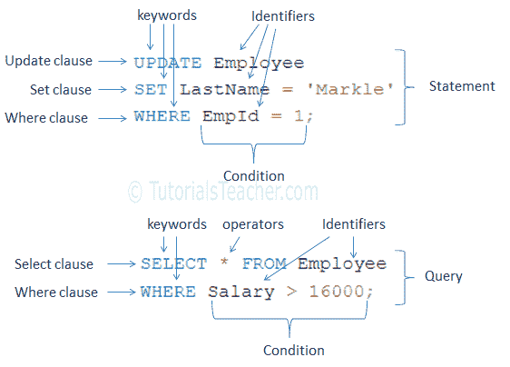

# 什么是 SQL？

> 原文：<https://www.tutorialsteacher.com/sql/what-is-sql>

SQL 代表结构化查询语言。SQL 用于查询和操作底层关系数据库，如 SQL Server、Oracle、MySQL、PostgreSQL、SQLite 等。

SQL 是 ANSI(美国国家标准协会)和 ISO(国际标准化组织)的标准语言。然而，并不是所有的数据库都支持相同的 SQL，但是变化很小。此外，大多数数据库都包含自己的 SQL。

## SQL 语法

SQL 包括以下几个部分:

*   **关键字:**关键字为保留词或非保留词。[SQL](https://en.wikipedia.org/wiki/SQL_reserved_words)中的保留关键字有 SELECT、INTO、UPDATE、DELETE、DROP、ASC、DESC 等。
*   **标识符:**标识符是数据库对象的名称，如表名、模式名、函数名等。
*   **子句:**子句构成了 SQL 语句和查询的组成部分，如 WHERE、GROUP BY、HAVING、ORDER BY。
*   **表达式:**SQL 中的表达式要么生成标量值，要么生成数据的列和行。
*   **布尔条件:**条件是导致布尔值为真或假的表达式。它们用于限制语句或查询的效果。
*   **查询:**查询是根据特定条件检索数据的 SQL 语句。以 SELECT 子句开头的语句称为查询，因为它们从基础数据库中检索数据。
*   **语句:** SQL 语句可能对模式和数据产生持久影响，或者可能控制事务、程序流、连接、会话或诊断。INSERT、UPDATE、DROP、DELETE 语句被称为 SQL 语句，因为它们修改底层数据库结构或数据。

下图说明了 SQL 的结构:

 

SQL Structure

## SQL 分类

SQL 分为以下几类。请注意，下表中提到的语句在不同的数据库中可能会有所不同。

| 命令 | 描述 |
| --- | --- |
| 数据定义语言 | 数据定义语言 |
| DoctorofModernLanguages 现代语言博士 | 数据操作语言 |
| TCL 集团股份有限公司（TCL Corporation 的缩写） | 事务控制语言 |
| 民法博士 | 数据控制语言 |

## 数据定义语言

数据定义语言(DDL)语句用于定义数据库中数据的结构，如表、过程、函数、视图等。下表列出了 DDL 语句:

| 声明 | 描述 |
| --- | --- |
| 创造 | 创建新对象(表、过程、函数、视图等)。)在数据库中 |
| 改变 | 修改数据库表的结构 |
| 滴 | 删除数据库对象 |
| 重新命名 | 重命名数据库对象(表、视图、序列、私有同义词) |
| 缩短 | 删除表的所有记录 |

## 数据操作语言

数据操作语言语句用于管理数据库对象中的数据。它允许操作和查询现有的数据库模式对象。下表列出了 DML 语句:

| 声明 | 描述 |
| --- | --- |
| 挑选 | 从表中检索行/列。 |
| 插入 | 向表中插入新数据。 |
| 更新 | 更新表的现有记录。 |
| 删除 | 从表中删除现有记录。 |
| 合并 | 根据指定的条件在表中插入新行或更新现有行。 |
| 锁定表格 | 以指定模式锁定一个或多个表。基于锁定应用的表访问被拒绝或只允许另一个用户访问。 |

# 交易控制语言

事务控制语言(TCL)语句用于完成通过执行 DML 语句对数据所做的更改。

| 声明 | 描述 |
| --- | --- |
| 犯罪 | 将事务更改永久保存到数据库。 |
| 反转 | 将数据库恢复到上次提交后的原始状态。 |
| 保存点 | 创建一个保存点，稍后由回滚命令用来撤消到该点的更改。 |
| 设置事务 | 设置事务属性，如读写或只读访问。 |

# 数据控制语言

数据控制语言(DCL)语句用于通过授予不同用户访问数据库的权限来加强数据库安全性。

| 声明 | 描述 |
| --- | --- |
| 同意 | 授予用户访问数据的权限。 |
| 取消 | 从用户处收回给定的权限。 |
| 评论 | 指定对数据库表和列的注释。 |
| 分析 | 收集表、索引、分区、集群等的统计数据。 |
| 审计 | 跟踪特定或所有 SQL 语句或操作在某个特定架构对象上的出现。 |

## SCL-会话控制语言

会话控制语言(SCL)语句用于通过执行 DML 语句来管理对数据库所做的更改。SCL 命令因数据库而异。下表列出了 Oracle 数据库的 SCL 命令。

| 声明 | 描述 |
| --- | --- |
| 修改会话 | 修改当前会话的数据库参数。 |
| 设置角色 | 为当前会话启用或禁用角色。 |