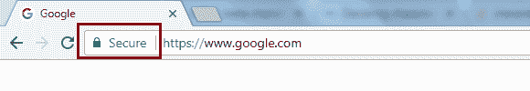
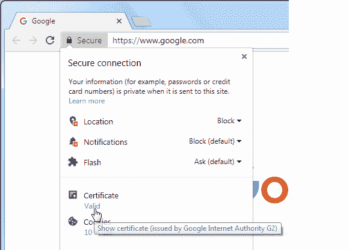
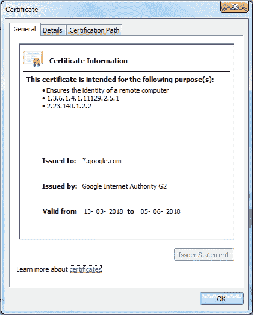
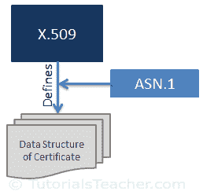

# 什么是 SSL 证书？

> 原文:[https://www . tutorial stearner . com/https/what-is-SSL-certificate](https://www.tutorialsteacher.com/https/what-is-ssl-certificate)

SSL 证书(也称为数字证书)在确保两个系统之间的通信安全方面发挥着重要作用。

SSL 证书是由授权的证书颁发机构(CA)颁发的数据文件。正如您在上一章中所学的，SSL 使用非对称加密技术，使用密钥对(公钥和私钥)在两个系统之间建立加密链接。SSL 证书包含所有者的公钥和其他详细信息。网络服务器通过 SSL 证书向浏览器发送公钥，浏览器验证该公钥，并使用 SSL 证书对网络服务器进行身份验证。

你可以打开任何 https 网站的证书。例如，在谷歌浏览器中输入网址 https://www.google.com 来检查 google.com 的 SSL 证书。任何 https 网站都将在地址栏中有一个安全挂锁，如下所示。

[<picture><source srcset="../../Content/images/https/https-in-browser.webp" type="image/webp"> <source srcset="../../Content/images/https/https-in-browser.PNG" type="image/png">  </picture>](../../Content/images/https/https-in-browser.png) 

<noscript>&#13; <a href="../../Content/images/https/https-in-browser.png" target="_blank">&#13; &#13; </a>&#13;</noscript>

SSL in Browser

单击挂锁符号，然后单击证书，如下所示。

[<picture><source srcset="../../Content/images/https/open-ssl-certificate.webp" type="image/webp"> <source srcset="../../Content/images/https/open-ssl-certificate.PNG" type="image/png">  </picture>](../../Content/images/https/open-ssl-certificate.png) 

<noscript>&#13; <a href="../../Content/images/https/open-ssl-certificate.png" target="_blank">&#13; &#13; </a>&#13;</noscript>

SSL Certificate

这将打开证书，如下所示。

[<picture><source data-srcset="../../Content/images/https/ssl-certificate.webp" type="image/webp"> <source data-srcset="../../Content/images/https/ssl-certificate.PNG" type="image/png">  </picture>](../../Content/images/https/ssl-certificate.png) 

<noscript>&#13; <a href="../../Content/images/https/ssl-certificate.png" target="_blank">&#13; &#13; </a>&#13;</noscript>

SSL Certificate

如您所见，在常规选项卡中，证书显示颁发给、颁发者和有效起始日期。“详细信息”选项卡包括其他信息。“证书路径”选项卡包括关于所有中间证书和根证书颁发机构证书的信息。

## X.509

[X.509](https://en.wikipedia.org/wiki/X.509) 是定义数字证书格式的标准。SSL 使用 X.509 格式。换句话说，SSL 证书实际上是 X.509 证书。

X.509 使用名为[抽象语法符号一(ASN.1)](https://en.wikipedia.org/wiki/Abstract_Syntax_Notation_One) 的形式语言来表示证书的数据结构。

[<picture><source data-srcset="../../Content/images/https/X509.webp" type="image/webp"> <source data-srcset="../../Content/images/https/X509.PNG" type="image/png">  </picture>](../../Content/images/https/X509.png) 

<noscript>&#13; <a href="../../Content/images/https/X509.png" target="_blank">&#13; &#13; </a>&#13;</noscript>

SSL Certificate

X.509 格式的 SSL 证书包括以下信息:

*   **版本:**按照 X.509 的证书数据格式的版本号。
*   **序列号:**CA 分配的证书的唯一标识符
*   **公钥:**所有者的公钥
*   **主题:**所有者姓名、地址、国家和域名
*   **签发人:**签发证书的认证机构名称
*   **有效期-自:**证书从 开始生效的日期
*   **有效期至:**到期日
*   **签名算法:**用于创建签名的算法
*   **指纹:**证书的哈希
*   **指纹算法:**用于创建证书散列的算法

## SSL 证书的类型

基于**验证级别**和**他们保护的域数量**，现在有不同类型的 SSL 证书可用。所有类型的证书的加密级别都是相同的，但是验证级别和外观是不同的。

## 基于验证级别的 SSL 证书类型

网站使用 SSL 证书来建立与访问者和客户的信任级别。不同的企业需要建立不同的信任级别。例如，收集用户重要信息的网站需要安全地传输这些信息。金融机构需要设置域真实性和数据安全性。因此，CA 需要根据他们想要建立的信任来验证网站所有者的信息。以下三种类型的证书基于验证级别。

### 域验证证书

域验证(DV)证书需要最低级别的验证，因为 DV 证书的主要目的是在域的网络服务器和浏览器之间进行安全通信。CA 仅验证所有者对域拥有控制权。

### 组织验证的证书

组织验证(OV)证书需要中级验证，其中 CA 检查组织使用域和组织信息的权限。OV 证书增强了组织及其域的信任级别。

### 扩展验证证书

扩展验证(EF)证书需要高级验证，CA 根据指导方针对组织进行严格的背景调查。这包括核实该实体的法律、实体和业务存在。

## 基于安全域数量的 SSL 证书类型

以下证书基于需要保护的域数量。

### 单一域证书

单一域证书保护一个完全合格的域名。例如，www.example.com 的单一域证书无法保护 mail.example.com 的通信。

### 通配符 SSL 证书

通配符 SSL 证书为单个域保护无限数量的子域。例如，example.com 的通配符 SSL 证书也将保护 mail.example.com、blog.example.com 等。

### 统一 SSL 证书/多域 SSL 证书/存储区域网络证书

在存储区域网络扩展的帮助下，统一 SSL 证书使用相同的证书保护多达 100 个域。它是专为保护微软交换和办公通信环境而设计的。

一旦您选择了您需要的 SSL 证书类型，您需要从知名的证书颁发机构获得它。在下一章中了解如何获得 SSL 证书。