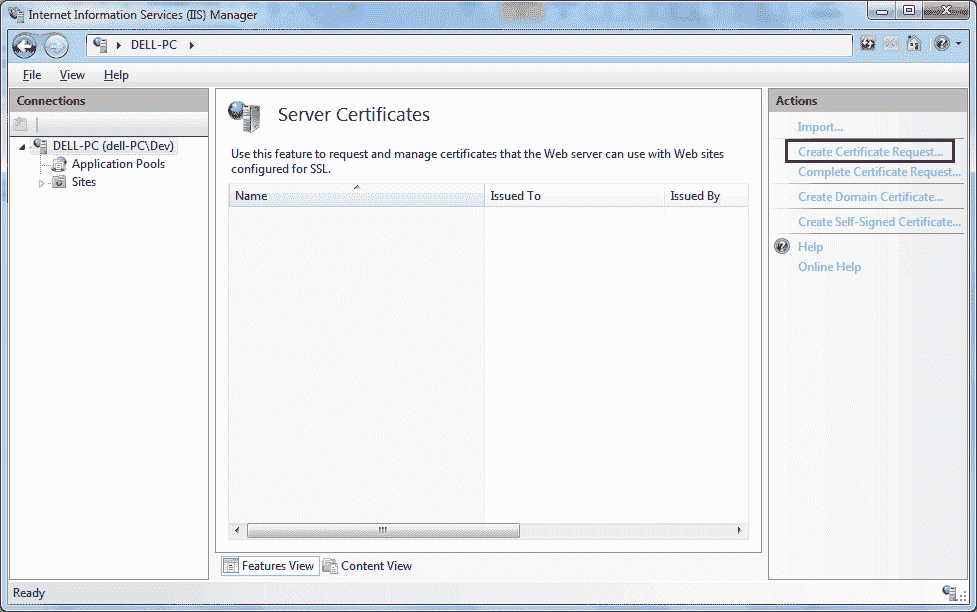
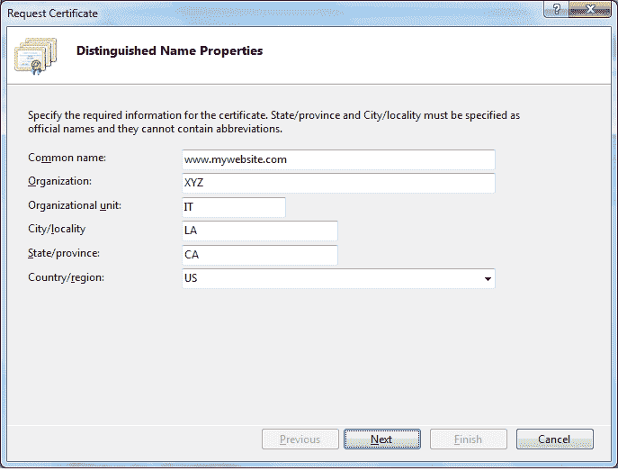
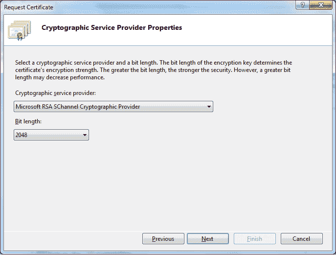
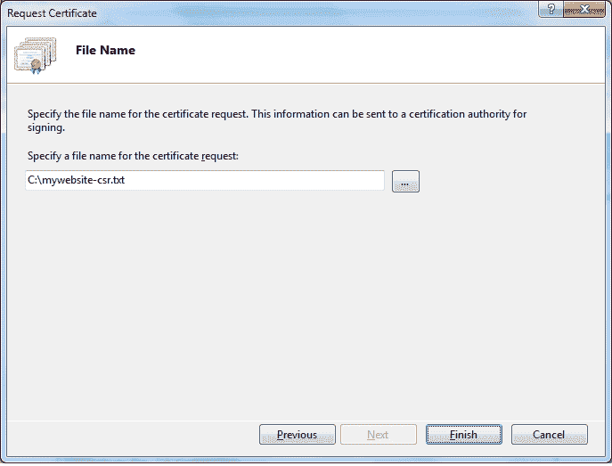

# 企业社会责任-证书签署请求

> 原文：<https://www.tutorialsteacher.com/https/certificate-signing-request>

为了获得网站的 SSL 证书，您需要生成证书签名请求并将其提交给证书颁发机构。

## 什么是企业社会责任？

企业社会责任是申请人提交给认证机构以获得 SSL 证书的编码消息。换句话说，这是申请人向认证机构提出的获得数字证书的请求。

企业社会责任包含公钥和申请人的信息，如 FQDN(完全合格域名)、组织名称和地址。认证机构验证申请人的信息，并使用企业社会责任中包含的公钥颁发 SSL 证书。

通常，企业社会责任是使用将要安装 SSL 证书的 Web 服务器生成的。然而，它也可以使用 SSL 工具或现代浏览器(如 Chrome 或 Firefox)生成。CSR 最常见的格式是 [PKCS #10 规范](https://en.wikipedia.org/wiki/PKCS)。

企业社会责任是一个 Base64 ASCII 编码的消息，以“-开始新证书请求-”开始，以“-结束新证书请求-”结束。以下是企业社会责任示例:

```
 -----BEGIN NEW CERTIFICATE REQUEST-----
    MIIERzCCAy8CAQAwZzELMAkGA1UEBhMCVVMxCzAJBgNVBAgMAk5ZMREwDwYDVQQH
    DAhuZXcgeW9yazEPMA0GA1UECgwGbXkgb3JnMQswCQYDVQQLDAJJVDEaMBgGA1UE
    AwwRd3d3Lm15d2Vic2l0ZS5jb20wggEiMA0GCSqGSIb3DQEBAQUAA4IBDwAwggEK
    AoIBAQCfvbkuJwMiwOwgvRAV1XS/HZFGH0I6/p2NyOn7onb8uEV3cMFf4iCzBN6Z
    KJD92qVtmZSBpH9IQrYiEohTxkgJ2c/dyX06eDVS7nE53etPOZCM8VvJOq/7PDo+
    7Kvy6jhQVU7Rb1mQrFcrU0GVOQWWqqtpHwbeKPfJ3mRlPNzygmXAUXkv0XdstQPm
    b5sVx965SGoIgrRUDpl+UNUcE198AVPEiDUg1VqY+mUmyOcvCkO153UtxDUMoocg
    S5WlfD83We35a7I6+FAvDKKk31gv6Jxfs/EzZ6D0iiytDMAWNRwDvaYcu06O8Ye/
    rt9mFF90XsMMn7xi0cuCaLzG7JrJAgMBAAGgggGZMBoGCisGAQQBgjcNAgMxDBYK
    Ni4xLjc2MDEuMjA1BgkrBgEEAYI3FRQxKDAmAgEFDAdkZWxsLVBDDAtkZWxsLVBD
    XERldgwLSW5ldE1nci5leGUwcgYKKwYBBAGCNw0CAjFkMGICAQEeWgBNAGkAYwBy
    AG8AcwBvAGYAdAAgAFIAUwBBACAAUwBDAGgAYQBuAG4AZQBsACAAQwByAHkAcAB0
    AG8AZwByAGEAcABoAGkAYwAgAFAAcgBvAHYAaQBkAGUAcgMBADCBzwYJKoZIhvcN
    AQkOMYHBMIG+MA4GA1UdDwEB/wQEAwIE8DATBgNVHSUEDDAKBggrBgEFBQcDATB4
    BgkqhkiG9w0BCQ8EazBpMA4GCCqGSIb3DQMCAgIAgDAOBggqhkiG9w0DBAICAIAw
    BAEFMAcGBSsOAwIHMAoGCCqGSIb3DQMHMB0GA1UdDgQWBBS4T+amOyNS+ECWfIxw
    eBUR+XRv+TCTfXvFRiQ35T960o79JqJZpaD+PS9HNghqS05ldsrA/p/n/1rG9T+n
    1a6jTj6BEwOLaTfUWlq8KtkkYiROOC9LqhQCn84PQuO3L9clLrsV//1C4hGkFUbG
    -----END NEW CERTIFICATE REQUEST----- 
```

## 生成企业社会责任

企业社会责任可以使用任何 Web 服务器生成。在这里，我们将从 IIS 7 生成一个企业社会责任。

点击**开始** - > **所有程序** - > **管理工具** - >互联网服务管理器。

在互联网信息服务管理器窗口中，选择您的服务器并双击**服务器证书**。

[](../../Content/images/https/csr-iis.png) 

Server Certificates in IIS


在右侧的**操作**面板中，单击**创建证书申请...**

[](../../Content/images/https/create-csr.png) 

Create CSR


在**申请证书**对话框中填写下面指定的信息，点击**下一步**。

*   通用名称:全限定域名(FQDN)。
*   组织:贵公司的合法注册名称(如我的公司)。
*   组织单位:组织中您所在部门的名称。该条目通常会被列为“信息技术”。
*   城市/地点:您公司的合法所在地。
*   州/省:您的公司合法所在的州/省。
*   国家/地区:您的公司合法所在的国家/地区。使用下拉列表选择您的国家。

[](../../Content/images/https/csr-info.png)

Certificate Signing Request


在加密服务提供程序属性页面上，选择**微软 RSA 夏内尔加密提供程序**作为加密服务提供程序，并从下拉列表中选择 2048 位长度，如下所示。点击**下一步**。

[](../../Content/images/https/create-csr2.png) 

Certificate Signing Request


提供企业社会责任文件的路径和名称。(如果您输入的文件名没有指定位置，您的企业社会责任将保存到 C:\Windows\System32。)

[](../../Content/images/https/create-csr3.png) 

Certificate Signing Request


点击**完成**。这将在指定的文件中生成一个企业社会责任。我的网站-csr.txt 中的上述 CSR 如下所示。 (在你的本地服务器上会有所不同。)

```
    -----BEGIN NEW CERTIFICATE REQUEST-----
            MIIERTCCAy0CAQAwZTELMAkGA1UEBhMCVVMxCzAJBgNVBAgMAk5ZMQswCQYDVQQH
            DAJOWTETMBEGA1UECgwKTXkgQ29tcGFueTELMAkGA1UECwwCSVQxGjAYBgNVBAMM
            EXd3dy5teXdlYnNpdGUuY29tMIIBIjANBgkqhkiG9w0BAQEFAAOCAQ8AMIIBCgKC
            AQEAtZL8bDFANNObNNc9vk7uMzmtWrqh/qnILcew2+bQ0X03aEtHXgZhTJ7MsC+F
            yEmkK5ZF9mJfJFAPlXJH5WLyEJWXkH65DxGhncSQhU1oBL2gwENYTPgTupg9l+Ro
            j8NV++DSYZUjAfF72GHI3+E/xvudusHj40QqwdxcoZJ6lTzx5T9VTv4iPMAveN7M
            e4yrAG3x28nrkarX8InEDGCojMtKr7wcHmEtz4mED//23X9hDUlnUpBkseBs5tgo
            AAgRCzrNkidXTwuVDVmQBqA4GAaHl1pIlxD6nd3v3N7GiN0kaxpeT6vqZyFBN5p/
            rM0cOnoOH9drKJHKvSuoq7g4GQIDAQABoIIBmTAaBgorBgEEAYI3DQIDMQwWCjYu
            MS43NjAxLjIwNQYJKwYBBAGCNxUUMSgwJgIBBQwHZGVsbC1QQwwLZGVsbC1QQ1xE
            ZXYMC0luZXRNZ3IuZXhlMHIGCisGAQQBgjcNAgIxZDBiAgEBHloATQBpAGMAcgBv
            AHMAbwBmAHQAIABSAFMAQQAgAFMAQwBoAGEAbgBuAGUAbAAgAEMAcgB5AHAAdABv
            AGcAcgBhAHAAaABpAGMAIABQAHIAbwB2AGkAZABlAHIDAQAwgc8GCSqGSIb3DQEJ
            DjGBwTCBvjAOBgNVHQ8BAf8EBAMCBPAwEwYDVR0lBAwwCgYIKwYBBQUHAwEweAYJ
            KoZIhvcNAQkPBGswaTAOBggqhkiG9w0DAgICAIAwDgYIKoZIhvcNAwQCAgCAMAsG
            CWCGSAFlAwQBKjALBglghkgBZQMEAS0wCwYJYIZIAWUDBAECMAsGCWCGSAFlAwQB
            BTAHBgUrDgMCBzAKBggqhkiG9w0DBzAdBgNVHQ4EFgQUAj8Shgvl57ZIzLNXt4se
            J4FfCwgwDQYJKoZIhvcNAQEFBQADggEBAFZ0RtA1q+H+xgdf19ccDzsoxqCA6NKV
            WARhrNG5ryC8+f0VhFSH1NOPyEY1aMEhIZLJp2BDaoPw2G+lxeTal70VzbObk5bw
            KTe3LAGWVENDVqmO3x3bFgXO5PfdFYTHMtXyyY6nZCurunFqGsovlCxuNqrQEgCD
            5Q9aZ6lcT8d2W2epae5bCzZ4WxHCUEHtYeja3hYQfk9eFpaAVq4KFIoBPnGY5L+V
            J1H79wda0p4+0kY1aB/PyVKNMZmuSphdeMD045hsKm6UFT+99ewq/ocKDIJX7U7V
            VOgQ/53fUmJ3zqUavcg+SxrwFF8wFU59VKPSGYoMBOWEPd/5pb0rGx8=
            -----END NEW CERTIFICATE REQUEST----- 

```

上述 CSR 包括我们以 Base64 PEM 格式提供的公钥和其他身份信息。

如果您使用的是不同的 Web 服务器，那么访问[商店的知识库](https://www.thesslstore.com/knowledgebase/ssl-generate?aid=52914109)并点击您所使用的 Web 服务器的链接，了解如何为您的 Web 服务器生成企业社会责任。

## 公钥和私钥

企业社会责任包括一个由 Web 服务器生成的公钥，您将在该服务器上安装一个 SSL 证书。当生成 CSR 时，Web 服务器生成密钥对、公钥和私钥。它在企业社会责任中包含一个公钥，还在文件系统中秘密存储一个私钥。在 web 服务器上安装证书时将使用该私钥。