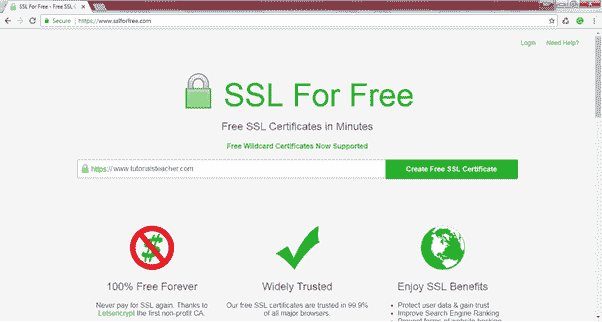
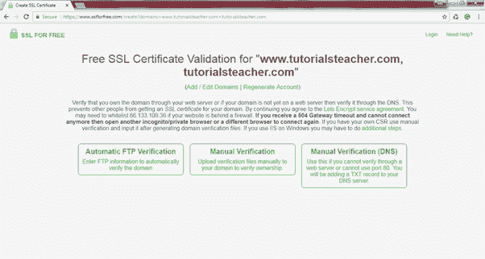
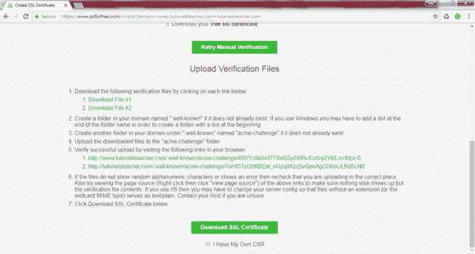
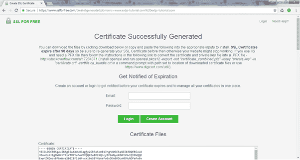
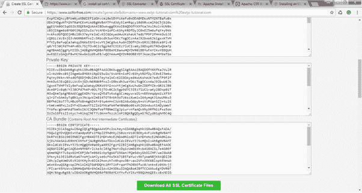
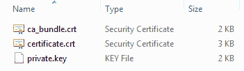

# 如何获得免费的 SSL 证书？

> 原文：<https://www.tutorialsteacher.com/https/get-free-ssl-certificate>

以下证书颁发机构提供免费的 DV(域验证)证书。

1.  让我们加密
2.  云 flare
3.  zerosso

## 让我们加密

[letsencrypt.org](https://letsencrypt.org)是由互联网安全研究集团(ISRG)运营的免费、自动化、开放的证书颁发机构。letsencrypt.org 的免费数字视频证书有效期为 90 天，可以轻松续订，并被火狐、Chrome 和互联网浏览器等所有主要浏览器识别。 在[入门指南](https://letsencrypt.org/getting-started/)了解如何从“让我们加密”获得免费证书。

有许多网络托管提供商为安装“让我们加密”证书提供内置支持。查看[支持我们加密](https://community.letsencrypt.org/t/web-hosting-who-support-lets-encrypt/6920)的主机提供商列表。

如果您的主机提供商不支持“让我们加密”证书，并且您发现很难使用 Certbot 手动获取证书，那么您可以前往[sslforfree.com](https://www.sslforfree.com)。 本网站通过使用域验证，使用咱们加密的 ACME 服务器生成免费证书。从 sslforfree.com 获得免费证书是百分之百安全的。让我们看看如何从 sslforfree.com 获得免费的 SSL 证书。

## 创建 sslforfree.com 证书

在谷歌 Chrome 浏览器中打开[https://www.sslforfree.com](https://www.sslforfree.com)。它将显示如下的网页。

 

Get a Free SSL Certificate from sslforfree.com

在文本框中，输入您的网站的完全限定域名，例如 www.tutorialsteacher.com。

 

Enter Website Name

点击**创建免费 SSL 证书**按钮。这将转到验证页面，在那里您需要验证您是否控制指定的域，如下所示。

 

Select Verification Method

您的域可以通过三种方式进行验证:自动 FTP 验证、通过将验证文件上传到您的域进行手动验证或通过向您的 DNS 服务器添加 TXT 记录进行手动验证。选择一个可行的方法来验证您的域。例如，选择需要上传验证文件的手动验证方式，如下图所示。

 

Manual Verification

选择验证方法后，选择**手动验证域**按钮。这将显示更多关于如何下载和上传验证文件到您的托管服务器的信息，如下所示。

 

Verification

成功完成上述验证流程后，点击**下载 SSL 证书**按钮即可下载 SSL 证书。

如果您的 Web 服务器生成了企业社会责任，请选择**我有我自己的企业社会责任**复选框。这将显示一个文本框来复制和粘贴您的企业社会责任，然后点击**下载 SSL 证书**按钮。

Enter CSR

这将生成证书并显示如下所示的页面。

SSL Certificates

向下滚动以查看您的证书、私钥和 CA 捆绑包(根证书和中间证书)，如下所示。

 

Certificate, Private Key & CA Bundle

点击**下载所有 SSL 证书文件**按钮，下载包含所有证书的 zip 文件。解压缩 sslforfree.zip，您将看到以下三个文件:

 

Certificate Files

正如你在上面看到的，你的证书和中级证书是在。crt 文件和. key 文件中的私钥。

一旦你拿到证书，你需要把它安装在你的 Web 服务器上。在 Web 服务器上安装 SSL 证书取决于您使用的操作系统和 Web 服务器。安装前，需要了解[证书格式和文件扩展名](/https/ssl-certificate-format)。

下一章学习如何购买 SSL 证书。