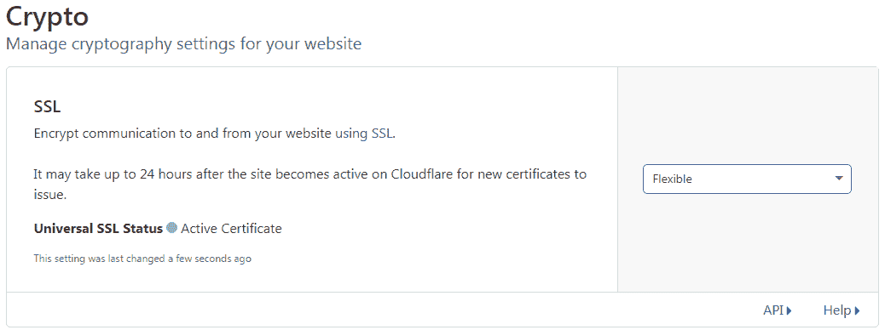
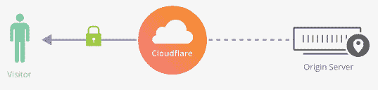
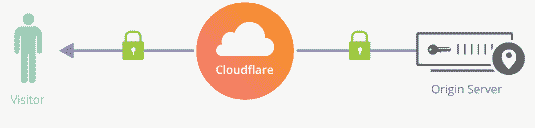
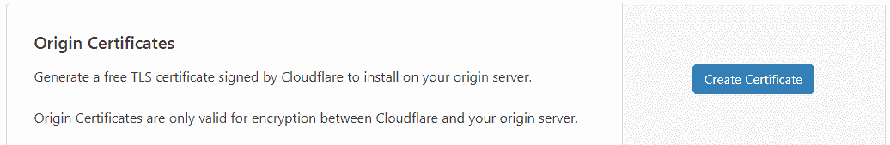
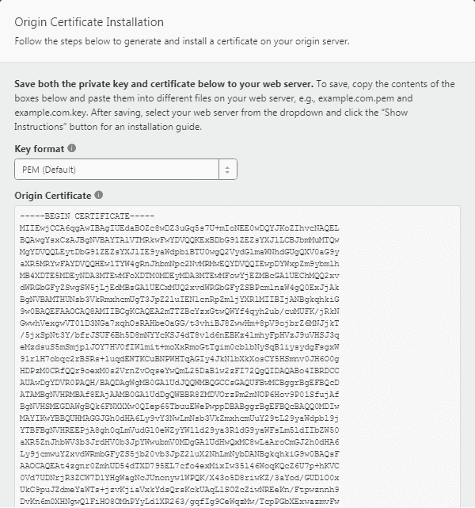
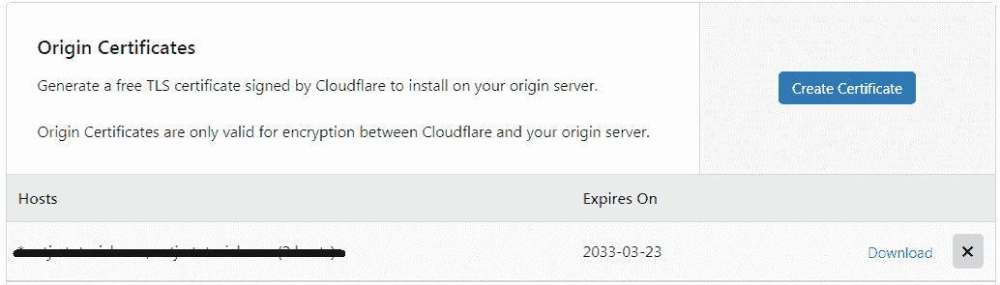

# 如何从 CloudFlare 获取免费的 SSL 证书？

> 原文：<https://www.tutorialsteacher.com/https/generate-cloudflare-free-ssl-certificate>

在这里，您将学习如何创建一个免费的 SSL 证书，并将其安装在您的托管提供商上进行端到端加密。

[cloulflare](https://www.cloudflare.com/)是全球最大的云网络平台之一。它加速并保护了数百万个网站。它还提供免费的内容交付网络

您可以通过创建一个免费帐户并添加您的网站来免费使用 CloudFlare。在这里学习如何做到这一点[。 一旦你创建了一个账户并添加了你的网站，在你的网站上启用 https 大约需要 24 小时。](https://support.cloudflare.com/hc/en-us/articles/201720164-Step-2-Create-a-Cloudflare-account-and-add-a-website)

ClouldFlare 为 SSL 证书提供了三个选项，灵活、完全和完全(严格)。在这里了解一下[。](https://support.cloudflare.com/hc/en-us/articles/200170416-End-to-end-HTTPS-with-Cloudflare-Part-3-SSL-options)

要为您的站点启用 https，请登录您的 CloudFlare 帐户并选择您的网站(如果您添加了多个网站)。

现在，转到加密选项卡，并从下拉列表中选择灵活的 SSL 模式。

这将允许您通过 https 访问您的网站，例如*https://www.mywebsite.com*。

但是，您还没有实现完全的端到端加密。这将只加密从您站点的访问者到 cloulflare 服务器的数据，而不会加密从 cloulflare 服务器到您的托管服务器的数据。

您必须使用完全或完全(严格)模式来实现完全端到端加密；为此，您必须创建 Clouldflare 的免费 Origin 证书或使用付费专用证书。

在这里，我们将生成 ClouldFlare 的原始证书，并将其安装在我们的托管服务器上。要创建原产地证书，请单击原产地证书部分的创建证书按钮，如下所示。

这将打开原产地证书安装弹出窗口，如下所示。

在弹出窗口中，保留默认设置，除非您知道如何创建私钥和 CSR。单击“下一步”按钮查看生成的 CSR 和私钥。

将生成的证书复制并保存为. crt 文件，将私钥文件复制并保存为. key 文件。这些可用于根据您的托管服务器要求生成证书文件。

单击确定在 Cloudflare 中创建证书。这将在原产地证书部分显示证书。

现在，您必须将此证书安装到您的托管服务器上，以便实现完全 ssl 加密。

更多信息请访问[cloudflare.com/ssl](https://www.cloudflare.com/ssl/)。

接下来，了解如何在微软 Azure 应用服务上安装 SSL 证书。