# 从 zerosso 获取免费 ssl 证书

> 原文：<https://www.tutorialsteacher.com/https/get-free-ssl-certificate-from-zerossl>

[Zerossl.com](https://zerossl.com)是一家提供 90 天免费证书的证书颁发机构。ZeroSSL 的免费 DV 证书有效期为 90 天，可以轻松续订，并被火狐、Chrome 和 Internet Explorer 等所有主要浏览器识别。

[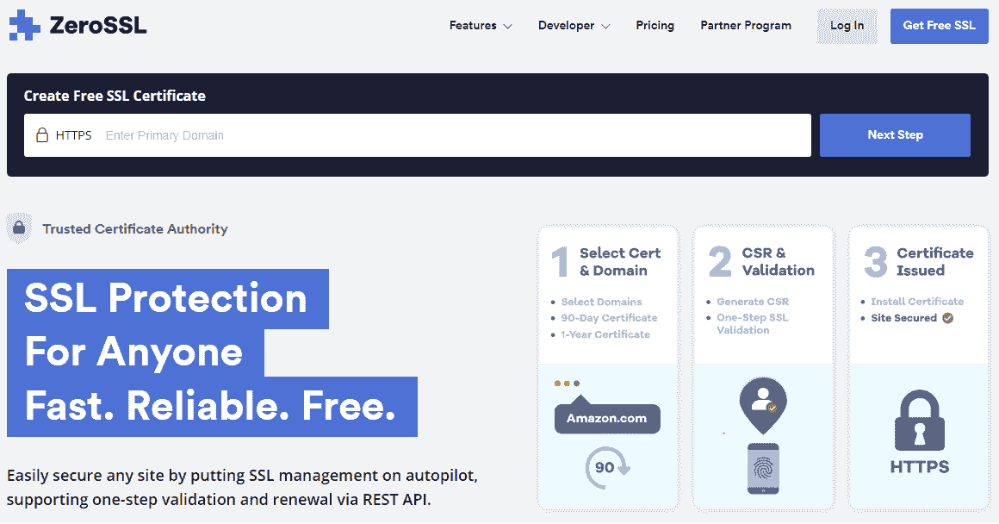](../../Content/images/https/zerossl.png) 

ZeroSSL 附带了一个功能齐全且简单的 SSL REST API，支持证书创建、验证、续订和管理，以及自动状态 webhooks。

[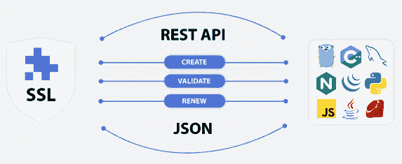](../../Content/images/https/zerossl-restapi.PNG) 

## 零 SSL 功能:

*   支持免费的 90 天证书以及高级的 1 年证书，易于证书验证和安装。
*   提供免费的多域证书来保护多个网站。
*   支持通配符 SSL，使用您的 SSL 证书保护固定或可变数量的子域。
*   自动生成企业社会责任，而不是手动输入一般、管理和技术联系信息，或者简单地粘贴您现有的企业社会责任。
*   支持一步式电子邮件验证和 CNAME 验证，以验证您的 SSL 证书的一个或多个域。
*   提供直观的管理控制台，允许您轻松配置新的 SSL 证书、进行验证、安装和管理所有现有证书。
*   开发人员可以使用 ZeroSSL 管理控制台来访问或重置他们的 API 访问键，以及导航到 ZeroSSL API 文档，以获得不同编程语言的集成指南和代码示例。
*   SSL 监控允许您检查证书的运行状况。
*   支持 ACME 自动化。

## 获得免费的 SSL 证书

要创建 90 天免费证书，请前往 zerossl.com。输入要获取证书的域名，然后单击下一步，如下所示。

[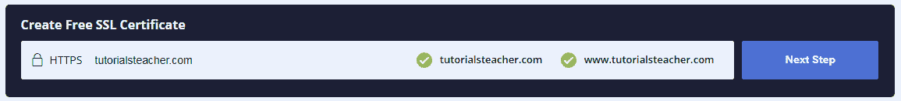](../../Content/images/https/create-certificate1.PNG) 

您需要在零 SSL 上创建一个新帐户，或者使用现有帐户登录，然后单击下一步。

[<picture><source data-srcset="../../Content/images/https/create-certificate2.webp" type="image/webp"> <source data-srcset="../../Content/images/https/create-certificate2.PNG" type="image/png"> 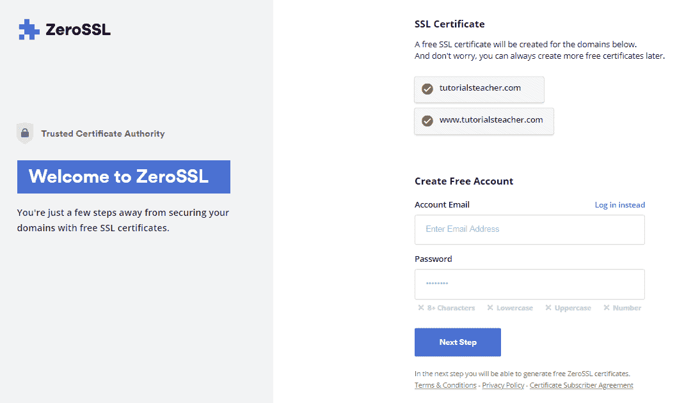 </picture>](../../Content/images/https/create-certificate2.PNG) 

在下一个屏幕上，单击顶部的创建证书链接或新建证书按钮来创建新证书。

[<picture><source data-srcset="../../Content/images/https/create-certificate3.webp" type="image/webp"> <source data-srcset="../../Content/images/https/create-certificate3.PNG" type="image/png"> 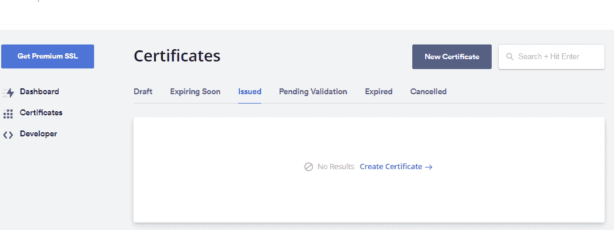 </picture>](../../Content/images/https/create-certificate3.PNG) 

接下来，输入要获取证书的域名，然后单击下一步，如下所示。

[<picture><source data-srcset="../../Content/images/https/create-certificate4.webp" type="image/webp"> <source data-srcset="../../Content/images/https/create-certificate4.PNG" type="image/png"> 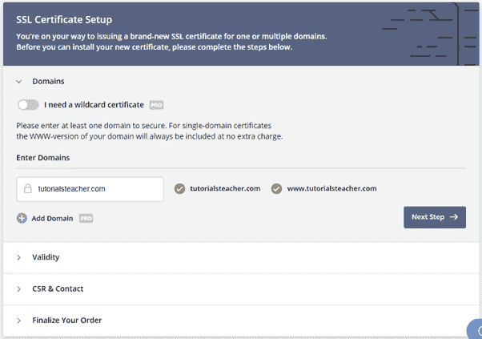 </picture>](../../Content/images/https/create-certificate4.PNG) 

选择 90 天证书单选按钮获取免费证书，然后单击下一步，如下所示。

[<picture><source data-srcset="../../Content/images/https/create-certificate5.webp" type="image/webp"> <source data-srcset="../../Content/images/https/create-certificate5.PNG" type="image/png"> 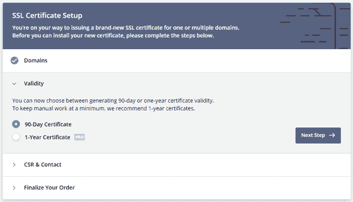 </picture>](../../Content/images/https/create-certificate5.PNG) 

在下一步中，自动生成企业社会责任默认打开。如果您想手动生成企业社会责任，请将其关闭。

[<picture><source data-srcset="../../Content/images/https/create-certificate6.webp" type="image/webp"> <source data-srcset="../../Content/images/https/create-certificate6.PNG" type="image/png"> 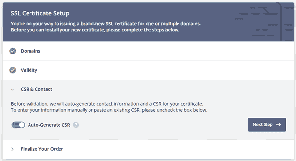 </picture>](../../Content/images/https/create-certificate6.PNG) 

在这里，选择免费订阅并点击下一步，如下所示。

[<picture><source data-srcset="../../Content/images/https/create-certificate7.webp" type="image/webp"> <source data-srcset="../../Content/images/https/create-certificate7.PNG" type="image/png"> 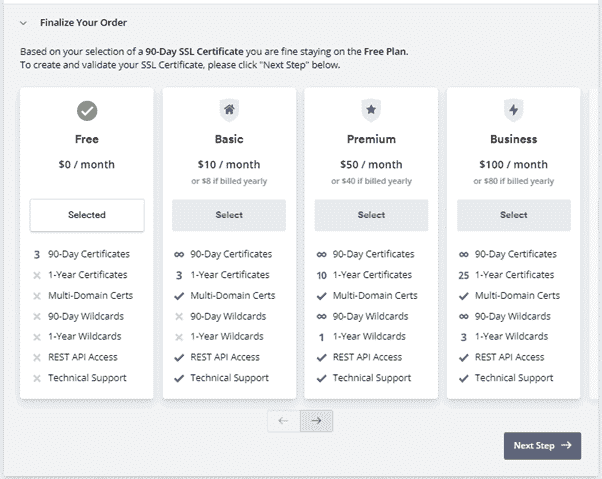 </picture>](../../Content/images/https/create-certificate7.PNG) 

接下来，选择验证方法并单击下一步。电子邮件验证将是最简单的。

[<picture><source data-srcset="../../Content/images/https/create-certificate8.webp" type="image/webp"> <source data-srcset="../../Content/images/https/create-certificate8.PNG" type="image/png"> 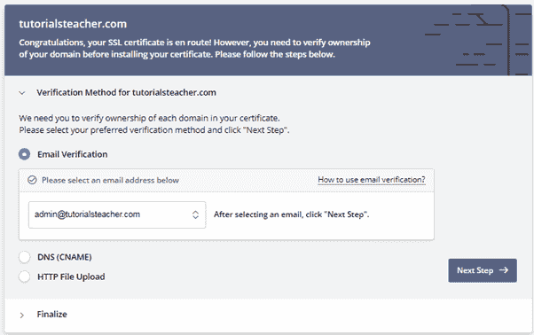 </picture>](../../Content/images/https/create-certificate8.PNG) 

在最后一步中，您需要使用上一步中选择的验证方法来验证您的域。成功验证后，它将为您的域颁发一个 SSL 证书。

[<picture><source data-srcset="../../Content/images/https/create-certificate9.webp" type="image/png"> <source data-srcset="../../Content/images/https/create-certificate9.PNG" type="image/png"> 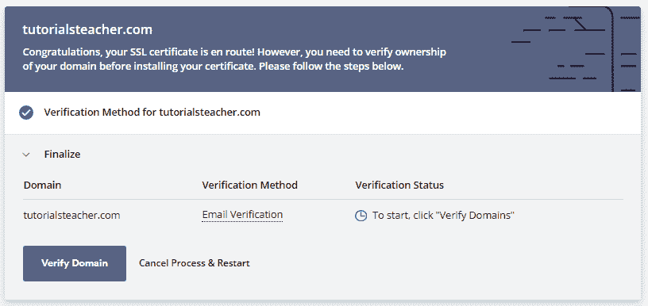 </picture>](../../Content/images/https/create-certificate9.PNG) 

因此，您可以从 ZeroSSL 创建一个免费的 90 天证书。