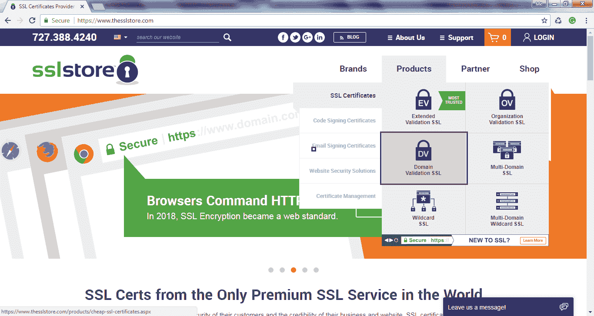
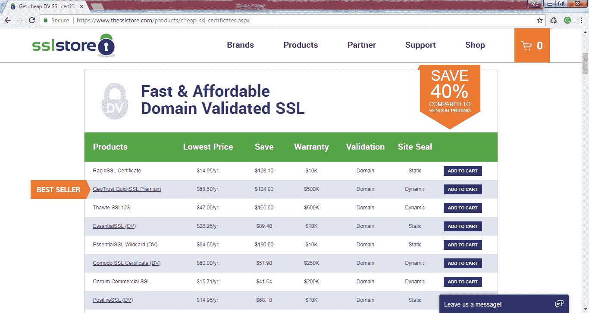
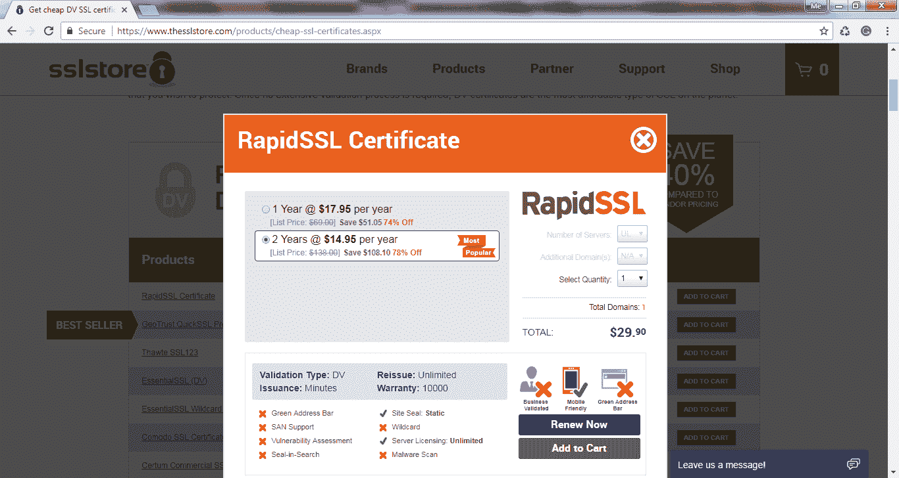
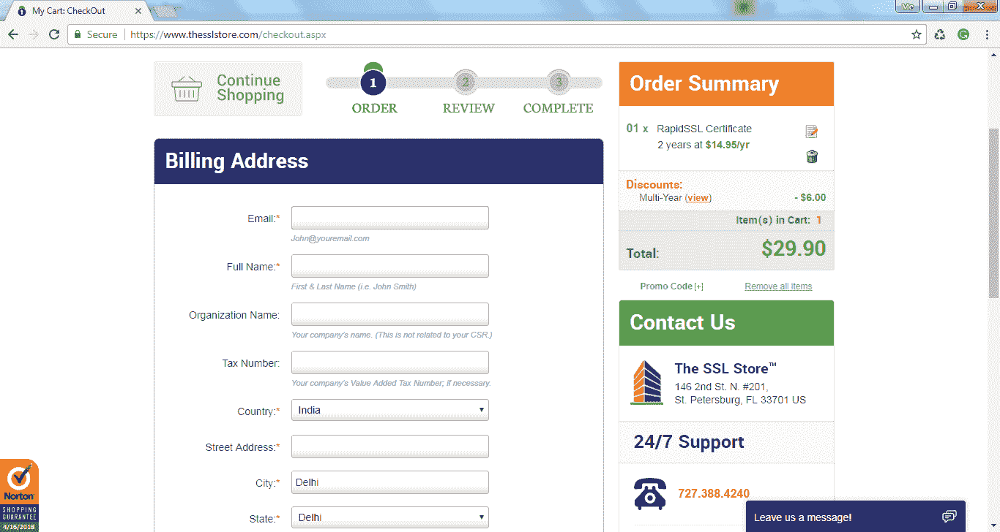

# 如何购买 SSL 证书？

> 原文：<https://www.tutorialsteacher.com/https/buy-ssl-certificate>

您可以直接从证书颁发机构或其经销商处购买 SSL 证书。[thesslstore.com](https://www.thesslstore.com?aid=52914109)是以最低价格购买知名 ca 的 SSL 证书的知名网站。 他们提供来自赛门铁克、GeoTrust、RapidSSL、thawte、Certum 和 COMODO 的 SSL 证书。 访问他们的[品牌](https://www.thesslstore.com/brands.aspx?aid=52914109)页面了解更多信息。

要从 thesslstore.com 购买 SSL 证书，请将鼠标悬停在“产品”菜单上，然后单击所需的证书类型。例如，让我们选择域验证 SSL，如下所示。

 

Buy DV Certificate

在 SSL 证书页面上，您将看到来自不同 ca 的价格合理的 SSL 证书列表。

 

Buy DV Certificate

向下滚动查看所有 CAs 中更多便宜的 DV 证书选项。

选择一个合适的证书和证书颁发机构，点击**添加到购物车**。这将打开一个弹出窗口，显示您选择的证书，如下所示。

Buy an SSL Certificate

点击弹出菜单中的**添加到购物车**按钮进行结账。在下一页，提供账单地址和支付详情，点击**继续**。

Buy an SSL Certificate

在下一页，查看信息，复制粘贴您的 [CSR](/https/certificate-signing-request) 并提交。

您还需要验证信息。完成后，您将通过电子邮件收到您的证书。这将是一个 zip 文件，包含一个 SSL 证书和您需要安装在您的网络服务器上的中间证书。

在 web 服务器上安装证书之前，了解 SSL 证书的格式和文件类型非常重要。在下一章中了解它们。