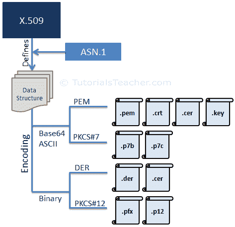

# SSL 证书格式

> 原文：<https://www.tutorialsteacher.com/https/ssl-certificate-format>

SSL 证书本质上是 X.509 证书。X.509 是定义证书结构的标准。它定义了应该包含在 SSL 证书中的数据字段。X.509 使用名为[抽象语法符号一(ASN.1)](https://en.wikipedia.org/wiki/Abstract_Syntax_Notation_One) 的形式语言来表示证书的数据结构。

有不同格式的 X.509 证书，如 PEM、DER、PKCS#7 和 PKCS#12。PEM 和 PKCS#7 格式使用 Base64 ASCII 编码，而 DER 和 PKCS#12 使用二进制编码。证书文件根据其使用的格式和编码有不同的扩展名。

下图说明了 X.509 证书的编码格式和文件扩展名。

 

SSL Certificate Format

## 质子交换膜格式

大多数 ca(证书颁发机构)在 Base64 ASCII 编码文件中提供 PEM 格式的证书。证书文件类型可以是。佩姆。阴极射线管。cer，或. key。pem 文件可以将服务器证书、中间证书和私钥包含在一个文件中。服务器证书和中间证书也可以在单独的。crt 或。cer 文件。私钥可以在. key 文件中。

PEM 文件使用 ASCII 编码，因此您可以在任何文本编辑器中打开它们，如记事本、MS word 等。PEM 文件中的每个证书都包含在- BEGIN CERTIFICATE -和- END CERTIFICATE -语句之间。私钥包含在- BEGIN RSA 私钥和- END RSA 私钥语句之间。CSR 包含在- BEGIN 证书请求和- END 证书请求语句之间。

## PKCS#7 格式

PKCS#7 格式是加密消息语法标准。PKCS#7 证书使用文件扩展名为. p7b 或. p7c 的 Base64 ASCII 编码。只有证书可以以这种格式存储，而不是私钥。P7B 证书包含在“- BEGIN PKCS7 -”和“- END PKCS7 -”语句之间。

## 格式

DER 证书是二进制形式，包含在。der or。cer 文件。这些证书主要用于基于 Java 的 web 服务器。

## PKCS#12 格式

PKCS#12 证书是二进制形式，包含在中。pfx 或. p12 文件。

PKCS#12 可以将服务器证书、中间证书和私钥存储在一个。带密码保护的 pfx 文件。这些证书主要在 Windows 平台上使用。

ca 以上述任何一种格式提供证书。在下一章中学习如何在不同的 Web 服务器上安装证书。