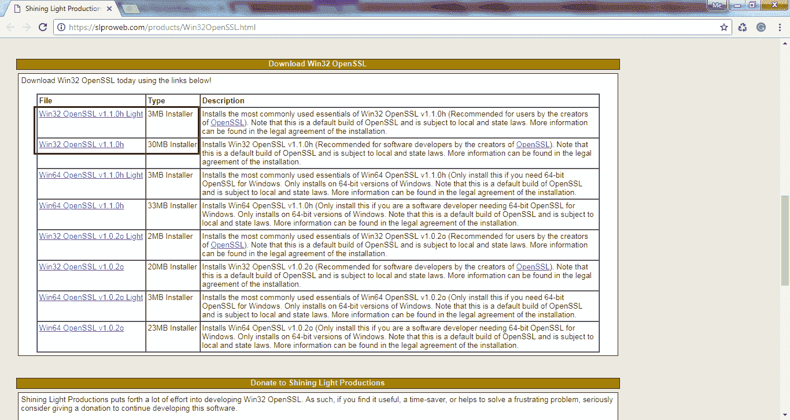
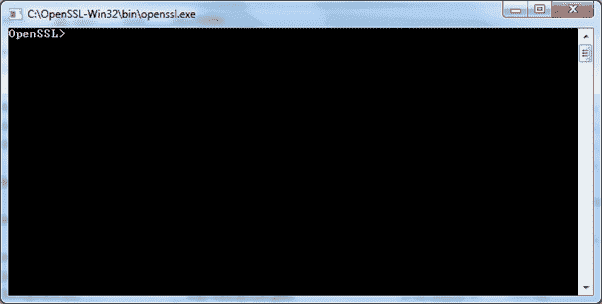

# 什么是 OpenSSL？

> 原文：<https://www.tutorialsteacher.com/https/openssl-certificate-convert-commands>

OpenSSL 是一个健壮的、商业级的、功能齐全的工具包，用于传输层安全性(TLS)和安全套接字层(SSL)协议。它也是一个通用的密码库。

OpenSSL 不以二进制形式分发代码。不过，你可以从其他网站下载。访问[wiki.openssl.org](https://wiki.openssl.org/index.php/Binaries)，选择并下载适合你平台的 OpenSSL。 例如，点击[https://slproweb.com/products/Win32OpenSSL.html](https://slproweb.com/products/Win32OpenSSL.html)链接下载 Windows 的安装程序。 可以下载轻装版或完整版，如下图。

[](../../Content/images/https/download-openssl.png)

Download OpenSSL Installer


单击安装程序并完成安装向导。安装后，转到 C:\OpenSSL-Win32\bin 并双击 openssl.exe 开始使用 OpenSSL。这将在 Windows 上打开一个命令提示符，如下所示。

[](../../Content/images/https/openssl-windows.png) 

OpenSSL Console


## 转换证书格式的 OpenSSL 命令

如果您从证书颁发机构获得了您的 Web 服务器不支持的证书文件，那么您可以使用 OpenSSL 命令将证书文件转换为您的 Web 服务器或主机提供商要求的格式。

要了解所有命令，请应用`help`命令。

```
Openssl> help
```

要获得特定命令的帮助，请在命令后使用`-help`。

```
Openssl> pkcs12 -help
```

以下是转换证书文件格式的主要命令。

### 将质子交换膜转换为质子交换膜格式

```
openssl> x509 -outform der -in certificate.pem -out certificate.der
```

### 将质子交换膜转换为 P7B 格式

```
openssl> crl2pkcs7 -nocrl -certfile certificate.cer -out certificate.p7b -certfile CACert.cer
```

### 将质子交换膜转换为 PFX 格式

```
openssl> pkcs12 -export -out certificate.pfx -inkey privateKey.key -in certificate.crt -certfile CACert.crt
```

### 将 DER 转换为 PEM 格式

```
openssl> x509 -inform der -in certificate.cer -out certificate.pem
```

### 将 P7B 转换为质子交换膜格式

```
openssl> pkcs7 -print_certs -in certificate.p7b -out certificate.cer
```

### 将 P7B 转换为 PFX 格式

```
openssl> pkcs7 -print_certs -in certificate.p7b -out certificate.cer
``` ```
openssl> pkcs12 -export -in certificate.cer -inkey privateKey.key -out certificate.pfx -certfile CACert.cer
```

### 将 PFX 转换为质子交换膜格式

```
openssl> pkcs12 -in certificate.pfx -out certificate.cer -nodes
```