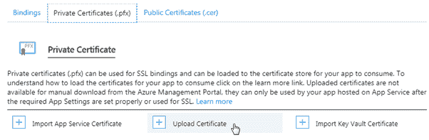
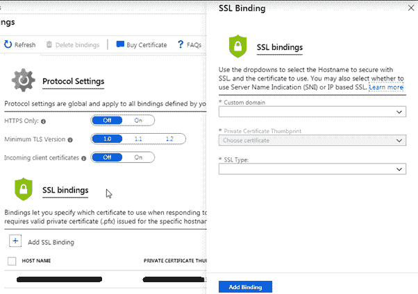

# 在 Azure 应用服务上安装 SSL 证书

> 原文：<https://www.tutorialsteacher.com/https/install-ssl-certificate-on-azure>

在前一章中，我们创建了 ClouldFlare 的免费 SSL 证书。在这里，我们将在 Azure 应用服务中安装它。

Azure 需要一个证书。pfx 格式。因此，您需要为证书生成一个. pfx 文件。

如果您的证书颁发机构没有提供。pfx 证书，然后您需要将您的证书转换为。pfx 格式。为此，您需要在机器上安装开放 SSL 工具。安装完成后，进入安装目录(在 Windows 上是 C:\OpenSSL-Win32\bin)，双击 openssl.exe 开始使用 OpenSSL。有关 OpenSSL 转换命令的更多信息，请访问 [SSL 证书格式](/https/ssl-certificate-format)和 [OpenSSL](/https/openssl-certificate-convert-commands) 。

在 OpenSSL 中执行以下命令来生成。pfx 文件。

```
openssl> pkcs12 -export -out mycertificate.pfx -inkey myprivateKey.key -in mycertificate.crt
```

在 Azure 上上传证书时，您将被要求输入密码。

该命令将生成 mycertificate.pfx 文件，您需要在 Azure 应用服务中上传该文件。

现在，转到您的 Azure 应用服务，并选择左侧栏中的 SSL 设置菜单。

首先，你需要在 Azure 上传你的原产地证书。转到私有证书()。pfx)选项卡，然后单击上传证书链接。

[](../../Content/images/https/upload-cert-azure.png) 

现在上传你的。pfx 证书，并提供您在生成。OpenSSL 中的 pfx 文件。

上传证书后，您需要将其绑定到 Azure 中的应用服务。转到绑定选项卡，然后单击添加 SSL 绑定。选择主机名，选择证书文件，并选择 SSL 类型为 SNI SSL。最后，点击添加绑定按钮将其绑定到您的应用服务。

[](../../Content/images/https/bind-ssl-azure.png) 

注意:如果您使用 cloulflare，那么您需要在 cloulflare 的加密选项卡中选择 SSL 模式为完全，以实现完全的端到端加密。